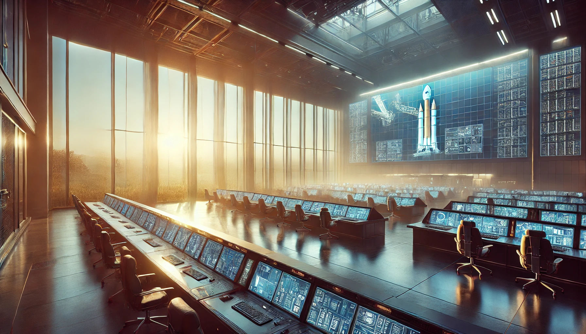

# 1. The Ring
   

December 1, 2031, 8:13 AM (EST)  
NASA Goddard Space Flight Center (GSFC),  
Greenbelt, Maryland, MD 20771, USA  

The morning sunlight seeps warmly through the windows.  
Monitors scattered across the room display the trajectory of Lucy, the asteroid explorer, their screens alive with data streams and orbital paths.  

Through the vast control center drifts the Beatles' "Lucy In The Sky With Diamonds"  

Cellophane flowers of yellow and green  
Towering over your head  
Look for the girl with the sun in her eyes  
And she's gone  
Lucy in the sky with diamonds  
Lucy in the sky with diamonds  
Lucy in the sky with diamonds  

diamonds  
diamonds...  

The chorus repeats in his dreams.  
But Dr. Alan Kennedy, the center director, had no choice but to wake up.  

Andrew handed each of them a donut and coffee.  
Dr. Kennedy and the operator rubbed their eyes as they ate.  

"By the way, how many years until Lucy returns to Earth?" 
"It was launched to Jupiter the year you graduated, Andrew, so that would be 2021? Almost 10 years now." 
"Why is it flying over there when it needs to return to Earth..." 
"Lagrange point L4... we'll be there in half a day. We'll know soon enough." 
"That area is full of asteroids, looks like we're about to waste a billion-dollar probe."  

The center director, Dr. Peter Kennedy.  
The operator who's been tracking Lucy's trajectory for the past three days.  
And Andrew, who just brought coffee and donuts.  
These three were the only ones in the control center this early morning.  

"Expand the predicted path and take a look." 
The operator activated the L'LORRI camera mounted on Lucy.  
But the expected trajectory shows only empty space, with distant stars twinkling.  
Though some large asteroids can be faintly seen far off the path.  

[Continuing translation...] 