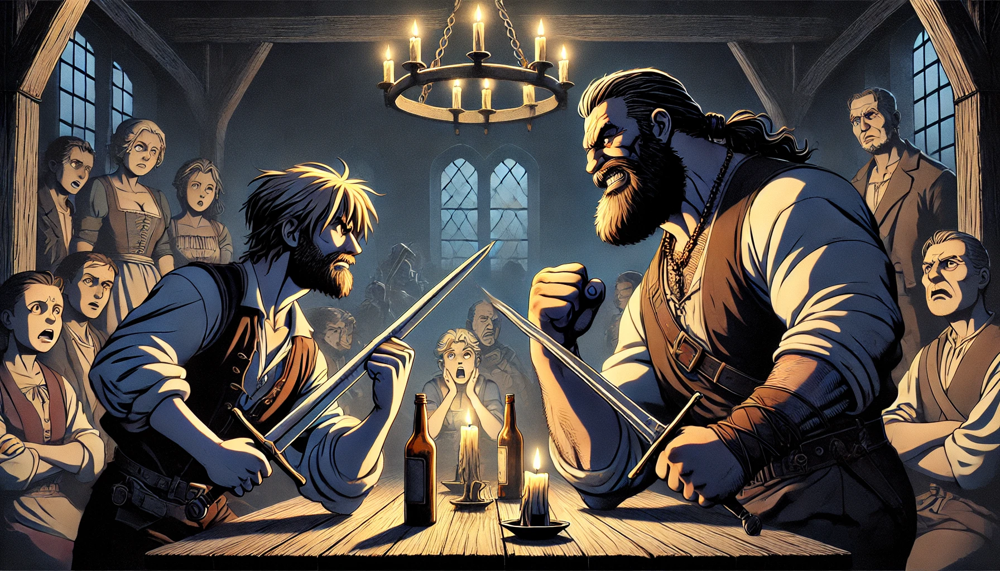

# Chapter 1. 젬스톤 광산

 

### 1. 베른(Bern)의 꺼지지 않는 촛불

   
스위스 베른의 조용한 거리 한편에 자리 잡은 오래된 맥주집은 그날 유난히 활기가 넘쳤다. Maria의 가족이 함께 방문한 이 맥주집은 조상 대대로 내려온 전설의 시작점이라 불리는 곳이었다. 따뜻한 나무 테이블에 둘러앉은 가족들은, 저마다 시원한 맥주잔을 들며 옛날 이야기에 빠져들 준비가 되어 있었다.

"할아버지, 그 전설은 정말 여기서 시작된 거예요?" Maria는 큰 눈을 깜빡이며 할아버지를 바라보았다. 어린 소녀의 눈은 이미 이야기에 대한 호기심으로 반짝이고 있었다. "하루 종일 걸었더니 다리가 부어올랐어요."

할아버지는 부드럽게 미소 지으며 고개를 끄덕였다. "그래, Maria. 그 정도 고생하면서 올만한 가치는 있는 곳이야".

거품서린 맥주가 할아버지의 목을 타고 들어간다. "바로 이곳에서 이야기가 시작됐지. 아주 오래전, GemSTON이 광부들 입에서 오르내리기 시작했어"

옆에 있던 Hans는 맥주는 반잔만 마시고 할어버지를 바라본다. "그덕분에 우리 조상님들은 수백년을 고향을 떠나 떠돌이 생활을 했잖아요"

Hans의 눈을 잠시 바라보다가 할아버지는 잠시 맥주잔을 내려놓고 손끝으로 Felix의 어깨를 감쌌다. "주머니에서. 한번 꺼내서 올려놓아보렴"

Maria의 사촌 중 하나인 Felix가 부시럭 거리더니 가방에서 보석 하나를 꺼내 테이블 위에 올려둔다. "그럼 그 보석은 어디에 있어요? 아직도 여기 베른에 있나요?"

입가에 옅은 미소가 할아버지 얼굴에 추억처럼 흩날린다. 맥주집 벽에 걸린 오래된 그림을 바라보았다. 그곳에는 마을의 옛 모습이 그려져 있었다. 그는 마치 시간 속으로 빨려 들어가는 듯한 표정으로 조용히 입을 열었다.

--------------------------------
베른의 밤은 고요했다. 언덕 위로 뻗은 돌길은 소금광산에서 돌아오는 광부들의 발소리만이 울려 퍼졌다. 소금으로 유명한 이 마을에 새로운 소문이 퍼지고 있었다. 소금이 아닌, GemSTON이라는 미지의 보석에 대한 이야기였다. 누구도 그 보석을 실제로 본 적은 없었지만, 마을 사람들은 마치 그것이 이미 현실인 것처럼 수군거렸다.

광부들이 모여드는 작은 선술집 안에서 사람들은 유난히 떠들썩했다. 평소처럼 소금 얘기만 나오는 것이 아니라, 신비한 보석에 대한 소문이 대화를 지배하고 있었다.

“들었어? GemSTON 말이야.” 한 광부가 낡은 잔을 들어올리며 말했다. 그의 눈은 흥분으로 빛났다.

분명 소금광산에서 오팔을 주웠어. 근데 이게 다른 암석이랑 뒤엉켜 있어서 잘 떨어지지도 않더군. 한덩어리 들어보니 이걸 돌이라고 해야할지 보석이라고 해야할지 GemSTON이라고 일단 치자고.

옆자리에서 다른 광부가 툴툴거리며 대꾸했다. “말도 안 돼. 보석 하나가 그렇게 특별하다니. 어디에 있는지도 모르잖아.”

“그렇긴 해. 하지만 소문에 따르면, 그 보석은 그냥 빛나는 게 아니야. 한 번 빛나기 시작하면 꺼지지 않는다더군.”

테이블 너머에서 젊은 소녀 Maria가 조용히 그들의 대화를 듣고 있었다. 그녀는 자신이 가진 비밀을 남들과 나누고 싶었지만, 그러기엔 아직 용기가 부족했다. 오늘 저녁, 그녀는 할머니로부터 오래된 전설을 듣게 될 예정이었다. 그 이야기가 마음속에서 그녀의 비밀과 연결될 것 같았다.

“이게 단순한 소문이 아니라는 걸 알면, 넌 뭐라고 할 건데?” 누군가가 물었다.

“말도 안 되는 소리 하지 마. 보석이 촛불을 대신한다고? 우리 같은 광부들이 촛불을 얼마나 쓰는지 알지? 밤새 꺼지지 않는 불빛이라니, 말도 안 돼.”

그때 Maria가 그들의 대화에 끼어들었다. “그럼 만약 그런 보석이 있다면, 믿을 수 있을까요?” 그녀의 목소리는 부드러웠지만, 그 질문은 모든 사람을 잠시 멈추게 했다.

광부들은 그녀를 쳐다보며 어리둥절했다. “그래, 소녀야. 그런 보석이 있다면, 우리는 믿겠지. 하지만 그건 어디까지나 꿈같은 이야기야.”

Maria는 그 말에 조용히 웃었다. 그녀는 손에 쥐고 있던 작은 GemSTON을 생각하며 가슴속에서 자라나는 신비한 감각을 느꼈다. 며칠 전부터, 그 돌이 빛나기 시작했는데, 이상하게도 불빛이 사라지지 않았다. 아마도 이 보석이야말로 그들이 말하는 GemSTON일지도 모른다고 생각했다. 그리고 그녀는 그 힘을 이해하기 시작한 것 같았다.

집으로 돌아가는 길에 그녀는 선명한 밤하늘을 올려다보았다. 오랜 전통이 얽혀 있는 이 마을에서, 그녀가 할머니로부터 들을 이야기는 그녀의 운명을 결정할지도 몰랐다. 할머니의 집은 낡았지만 아늑했다. 문을 열고 들어가자 할머니는 모닥불 앞에 앉아 있었다. 그 옆에는 오래된 보석함이 열려 있었다.

"Maria, 이제 이 보석의 진짜 이야기를 들을 때가 왔구나," 할머니는 낮고 따뜻한 목소리로 말했다. 그녀의 손에 쥔 GemSTON 목걸이가 모닥불빛에 반짝였다.

"이건 단순한 보석이 아니란다. 우리 집안은 오랜 세월 동안 이 보석을 지켜왔단다. 그리고 이제 네가 그 운명을 이어받을 차례란다."

Maria는 눈을 동그랗게 뜨고 물었다. “저도 이걸 사용할 수 있나요? 정말로 이 힘을 쓸 수 있는 거예요?”

할머니는 미소를 지었다. “너는 이 힘을 이미 알고 있지 않니, Maria? 너는 빛을 꺼지지 않게 만들 수 있단다.”

그녀는 그 말을 믿을 수 없었지만, 그녀의 손 안에 있던 보석은 여전히 빛나고 있었다. 그리고 그날 밤, 할머니는 그녀에게 더 깊은 이야기를 들려주었다. GemSTON은 단순한 광석이 아니었다. 그것은 옛날 유대인 혈통을 통해 전해진 전설의 일부였다.

" 더 이야기 해주세요"

" 오늘은 그만 자도록 하자, 우리 아기"
   

      

# English
### 1. The Ever-burning Candle

   
In the quiet streets of Bern, Switzerland, during the 13th century, an old tavern brimmed with life. Known as the starting point of a legendary tale passed down through generations, Maria's family gathered at a warm wooden table inside. With frosty mugs of beer in hand, they were ready to dive into stories of old.

"Grandfather, did the legend really start here?" Maria asked, her eyes wide with curiosity, sparkling with eagerness for the tale. "My legs are swollen from walking all day."

With a gentle smile, Grandfather nodded. "Yes, Maria. It's worth the trek you've made."

Foamy beer trickled down Grandfather's throat. "It all started right here. Long ago, the GemSTON began circulating among the miners."

Hans, sitting beside him, sipped only half his beer and turned to Grandfather. "Because of it, our ancestors wandered for centuries, far from home."

Grandfather paused, setting down his mug to rest a hand on Felix's shoulder. "From your pocket. Bring it out for us to see."

Felix, one of Maria's cousins, rustled in his bag and placed a gem on the table. "So where is this gem now? Is it still here in Bern?"

A faint smile fluttered across Grandfather's face like a memory. He glanced at an old painting on the tavern wall depicting the village in ancient times. He seemed to drift back through the ages as he began to speak.

Bern's night was tranquil. The stone path stretching over the hill echoed with the footsteps of miners returning from the salt mines. In this town famed for salt, a new rumor was spreading about an unknown gem called GemSTON. Though no one had seen it, the villagers whispered as if it were real.

Inside a small pub, the miners were unusually animated. The usual talk of salt was overtaken by tales of the mysterious gem.

"Have you heard? About the GemSTON," one miner raised his worn glass, his eyes alight with excitement.

"I swear it was opal I picked up in the salt mine. It was tangled with other rocks, hard to separate. It felt odd, calling it a rock or a gem, so let's just say GemSTON."

Another miner scoffed, "Nonsense. A gem that special? We don't even know where it is."

"That may be, but rumor has it, this isn't just any shining gem. Once it starts glowing, it never stops."

From across the table, young Maria listened quietly. She wanted to share her secret, but lacked the courage. That evening, she was to hear an ancient legend from her grandmother, a tale that seemed to connect with her secret.

"If this isn't just a rumor, what would you say then?" someone asked.

"Don't be foolish. A gem replacing a candle? Do you know how much we miners use candles? A light that never goes out, that's impossible."

That's when Maria joined their conversation. "What if such a gem existed? Would you believe it?" Her voice was gentle, but her question halted everyone.

The miners stared, puzzled. "Yes, girl. If such a gem existed, we'd believe. But it's nothing more than a fanciful tale."

Maria smiled quietly. She thought of the small GemSTON she held, which had started to glow a few days earlier and strangely, the light hadn't faded. Maybe this gem was the GemSTON they spoke of. And she felt she was beginning to understand its power.

Walking home under a clear night sky, she anticipated the story she would hear from her grandmother. Her grandmother's house was old but cozy. As she entered, her grandmother sat by the fire, an open jewel box beside her.

"Maria, it's time you heard the true story of this gem," her grandmother spoke softly, the GemSTON necklace sparkling in the firelight.

"It's not just any gem, my dear. Our family has guarded it for generations. And now, it's your turn to carry on this destiny."

Maria's eyes widened. "Can I use it too? Can I really wield its power?"

Her grandmother smiled. "Don't you already know, Maria? You can keep the light alive."

She couldn't believe it, but the gem in her hand continued to shine. That night, her grandmother told her a deeper tale. The GemSTON was more than a mere mineral. It was part of a legend passed down through Jewish lineage.

"Tell me more," Maria pleaded.

"Let's call it a night, my child," her grandmother decided, as Maria's eyes drifted towards sleep.
   
