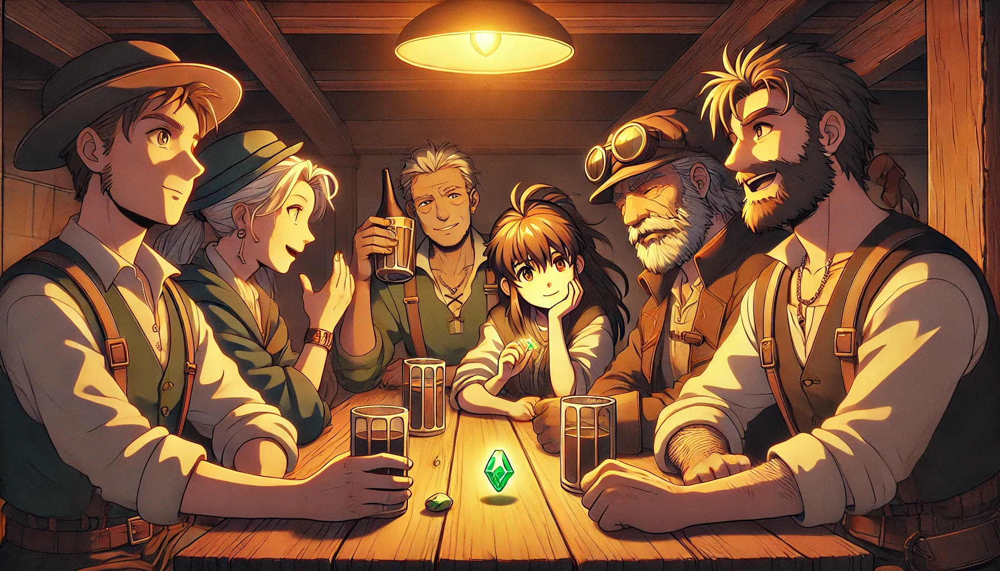
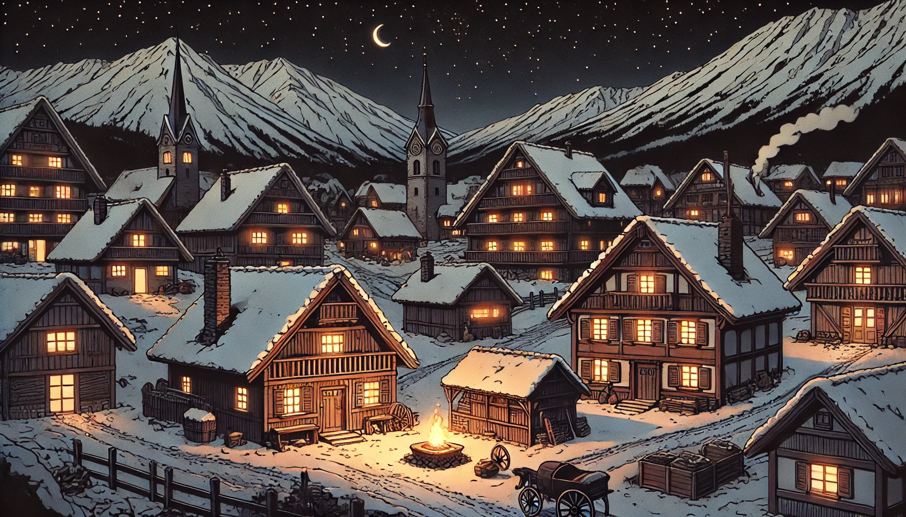
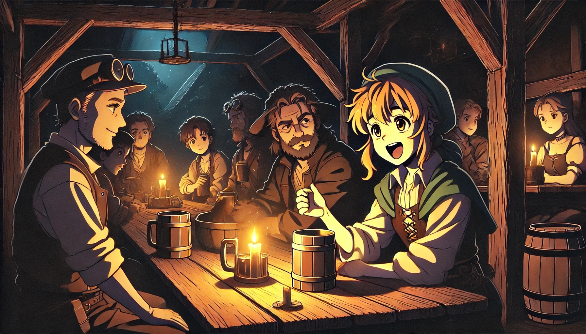

# Chapter 1. The Ever-Buring Candles in Bern

**_My dear grandson Peter._**  

**_I have arrived in Bern ahead of the others._**  

**_Christian's group has also left Australia to come see this old man, so let's meet as planned tomorrow evening at Cafe Marta._**  

**_And make sure to bring the item we talked about._**  

**_It was donated by our family, after all; what harm could there be in taking it out briefly?_**  

   
---

### 1.1. Maria

   

"Put it on the table for a moment." 

"What will others think if they see this? Grandpa, really..." 

"They'll probably think it's a souvenir, from Bern, especially in a place like this." 

"Oh dear, Cafe Marta isn't a bar. You just insisted we order drinks, haha." Claudia, with her bright eyes, gave her grandfather's shoulder a rub. 

Peter, who had just arrived, flopped down onto a chair, rummaged through his bag, and then placed a gem on the table. He thought his grandfather was being unusually careless today. 

Suddenly, the table lit up with a brilliant light that burst forth. 

"I just brought it along." Peter muttered. 

"Really, our grandmothers used to wear such big gems around their necks?" Claudia briefly touched the gem. 

"If we get caught, I'll be kicked out of CERN. It's such a hard-earned job." Peter still seemed annoyed. 

Grandpa glanced at Peter and gave a slight nod. 

"From a family of miners to having a physicist in the family, huh?" 

The other grandchildren giggled. 

"Well, we can't have you getting kicked out, huh." Christian said, passing a beer to Grandpa. 

"He might have sold books, but we've always dug the land." The grandchildren each flaunted their necklaces, earrings, and bracelets. 

"But we are richer, haha."  "Isn't building up the jewelry business tougher than physics, Peter?" 

The quiet streets of Bern.  An old cafe located on a corner was unusually lively tonight. Perhaps it was because the descendants of the Maria family, who had long ago left the place, had come to visit. 

As the beer they ordered was served, Claudia licked her lips and lifted her head to tie up her long hair. 

She noticed a painting across the wall. 

"It really looks just like it's from the picture." 

Claudia alternated her gaze between the sparkling gem on the table and the jewel in the painting on the wall. 

In the painting, a giant wielding a large Hilbert axe was depicted, and a large gem shone embedded in his armor. 

"Do you like it?"  Grandpa stood up and checked if the painting was symmetrical.  "The first thing I did when I took over this cafe yesterday was to hang this painting." 

"What?" The jaws of the grandchildren, busy with their beer and cutting white sausages, dropped in unison. 

"You bought this place? What are you planning to do?" Claudia hurriedly interjected before her grandfather could digress. 

"I said let's just look at the old stories, but that's just the start, I have quite a bit to do here," Grandpa cheekily scooped the neatly sliced white sausage from Peter's plate to his own. "Of course, I'll be sleeping at Peter's place." The grandchildren continued to snicker. 

"Grandpa, honestly, I can't believe it," Peter retorted sharply. 

"We used to listen to it as a bedtime story when we were kids. How can it become reality? We're not kids anymore." 

Claudia's eyes, large and amused, darted from Peter to Grandpa. She suppressed a laugh, resting one hand on her chin. But the other grandchildren were unusually focused on Grandpa's next words. 

"Oh... What? You all paying attention now?" Claudia scanned around, and the oldest grandchild, Christian, spoke up. 

"I've always wanted to ask. We've been in the jewelry business generation after generation, but sometimes the legends tied to the jewels felt almost real." 

"Of course, it's real."  The frothy beer went down Grandpa's throat. 

"It all started right here in Bern. This jewel reacted only to the women in our family." 

Grandpa fondled the gem, its self-luminous light flickering, making the faint smile on his lips seem distant. 

And looking again at the old painting on the wall, he quietly began. The grandchildren had heard this seemingly cliché legend hundreds of times, but the crisp Bern night air made everything seem possible. 

--------------------------------
   

   

The night in 13th century Bern.  Still as tranquil as this evening. 

The hillside is already shadowy. The path just bathed in sunlight is now filled with the sound of miners returning from the salt mines. 

In the tavern filled with the smell of meat soup, father looks at a candle. His deep wrinkles are accentuated by the candlelight. 

"It was a hard journey to get here, and they don't even sell candles. Damn them..." He's halfway through his beer. 

"It's a luxury we can't afford anyway. Forget it."  Mother says lightly, sipping her soup.  "We're penniless. When we left Rome, all our gold coins were confiscated..." 

"They claim to serve God, but they only choose to do the worst things," Father says as he breaks bread to dip into his soup, then sets it down. "While working in the mines, how many of our family died. And they wouldn't let us take any gold or silver bars, just told us to take these stones that might as well be buttons..." 

A rather pretty pebble rolls across the table. 

Maria and Hans, just starting to learn to read, curiously unpack a bag of stones and play with them on the table. 

"It's a good thing your grandmother and aunt collected these pretty stones. What would we have done without them, right, aunt?"  Uncle Andreas, ten years younger than father, supports mother. 

Mother smiles and serves more meat into the soup, pushing a bowl towards father. He tries not to look at it. 

"You're so stubborn. How are we supposed to go into the mines without candles?" 

Father snaps at mother in frustration, then turns away guiltily. He then looks over Maria, Hans, and the other nephews and nieces who came along, a large family of about ten. 

"We need to work in the mines to feed this big family. Otherwise..."  Father stops mid-sentence. 

Father finishes the rest of his beer. Mother's consolation seems less comforting than half a glass of beer. 

"Brother, hang in there. Even just allowing us Jews to live in the same neighborhood is something to be grateful for."  Uncle Andreas holds father's hand. 

"If we can't settle here, I'll go out as a mercenary with Andreas," Father replies, clasping uncle's hand. The two looked at each other quietly and calmly for a long while. 

"Has anyone survived being a mercenary? What are you saying in front of the kids?"  Suddenly, the whole family falls into silence. 

Maria, who was playing with pebbles with her fern-like hands, starts to glance at father. Maria and Hans, still young, continue to play with the stones, their eyes brimming with tears.  Maria hugs her brother Hans to keep him from crying, bows her head, and grips the pebbles tightly in her hands. 

"It's better than living as an irresponsible father," Father says calmly as Maria's tears fall onto the pebbles. 

"Father! And uncle!"  Maria suddenly stands up, shaking the bag of gems and smiling brightly. Ever optimistic, she locks eyes with her father and beams a big smile. 

"I'll try selling these myself. I've brought plenty on the donkey, I'll just go to another village and exchange them for candles!" 

   

Bang!  

Suddenly, the tavern shakes.   A large figure squeezes through the tavern door, making the hinges groan.  

"Oh! Maximilian. Did you find something good today?" 

"You're strong enough to dig up anything, aren't you? Leave some for us, Max." 

"Boys, Max is here. Bring over a barrel of beer."  

Max, as the large figure is called, scans the room and deliberately sits next to father, placing his thick hands on the table which creaks under their weight. 

"That’s the Jew fussing for candles in front of the mine just now," Max says with a sneering look at father's profile. 

"I don’t care if you dig a new mine or not, but you can’t bring candles into this neighborhood without my permission." As the beer arrives, Max downs it in one go. 

"I’m the only chandler licensed by Duke Chellington. Where do you think you, who don’t pay a penny in taxes..." 

Before he can finish, mother screams. With a deadpan face, father stands and starts smashing the tavern's candles one by one with his beer mug. 

"You crazy man... This is my tavern. Do you even have the money to pay for the candles?" Max pulls out a knife from his sheath. With a fiery glare, he flips the table over. 

"If you can beat me in a duel, I won't charge for the candles." 

Max throws a sword from the wall at father. Mother has fainted, and Uncle Andreas is holding back Maria and Hans as they try to run to their father. Maria's eyes are swollen from crying. 

Max easily pushes father into a corner with one arm, and soon his sword shoots up into the air. 

At that moment, a bright light flies from behind and reflects off Max's sword, blinding him. Angry, Max turns around as if his neck might snap. 

.  .  .  . 

The people stare at the spot.  The tavern, darkened by extinguished candles, suddenly lights up brightly. 

Amidst the murmuring crowd, the figure holding something shining like broad daylight gradually appears. 

It was Maria.  Maria, who Uncle Andreas had pushed against the wall for protection. 

Not just that.  The pebbles on the table were shining brighter than the candles. 

"Sir.., Could you..."  

"Could you... accept this instead of the candle my daddy broke?""  Maria looks up at Max with her swollen eyes, smiling innocently. 

"What on earth have you done?" 

Mother, Uncle, and even the cousins who had dashed out of the tavern were all wide-eyed with shock. Not knowing what to do, Maria started to sob, and her mother embraced her tightly. 

Back at home, hurried back with mother carrying her.  Mother wakes up Maria. 

"Maria" 

"...Mom, I'm sorry. It's because of the pebbles, isn't it?" 

"It's not about the pebbles." 

Thirsty, mom held a glass of water in one hand and looked around for the jug. Then she opened the window and looked up at the sky. After a long pause, she spoke. 

"Maybe you are the problem." 

The curtains fluttered in the wind, revealing a strange smile on mom’s face illuminated by the moonlight. 

"It's late, but you should go to your grandmother's." 

Grandma lives alone in a cabin just up the hill next to them. Knowing what Maria might say next, mom added. 

"You can stay over if you need to." 

Maria left the house through the back door to avoid waking anyone, wearing her cape and carrying a torch to light her way to the stable. 

But she stopped just a few steps out. 

In the wagon parked next to the stable, bags full of pebbles shone brightly, illuminating the street. 

"No need to trade them for candles." 

   

