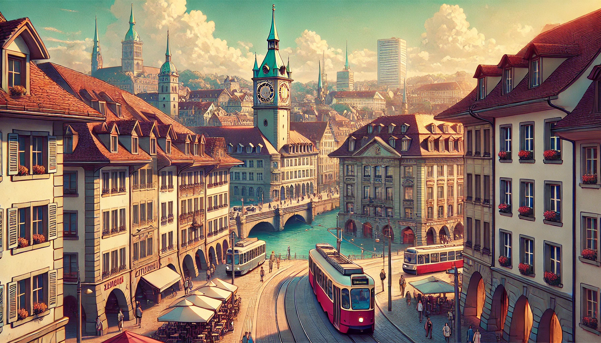

# 제1장: 잼스톤 광산

   **_사랑하는 피터._**  

   **_할아버지는 먼저 베른(Bern)에 도착했다._**   

   **_크리스티앙 일행도 호주에서 출발했다고 하니, 예정대로 내일 저녁에 Cafe Marta에서 보자꾸나._**  

   **_그리고, 약속한 그건 꼭 들고 와야 한다._**  

   **_어차피 우리 집안이 기증한건데 잠깐 꺼내온다고 뭐 별일이야 있겠니?_**  

   
---

### 1.1. 베른(Bern)의 꺼지지 않는 촛불

   

"그거 한번 탁자위에 올려봐" 

"남들이 보면 어쩔려구요? 할아버지도 참..." 

"기념품인 줄 알겠지, 관광지 베른(Bern)에서, 더구나 이런 술집에서" 

"아이 참, Cafe Marta는 술집이 아니에요. 할아버지가 억지로 술을 시킨 것일뿐 하하" 총명한 눈칩을 가진 클라우디아(Claudia)가 할아버지의 어깨를 주물러 드린다.  

막 도착한 피터(Peter)는 할아버지가 오늘따라 조심성이 없다고 생각했다. 의자에 대충 걸터앉아서 가방을 뒤져 부시럭 거리더니 테이블 위에 보석 하나를 올려놓았다. 

순간 테이블이 환해질 정도로 영롱한 빛이 뿜어져 나온다. 

"이거 그냥 들고 나온거에요. 들키면 쎄른(CERN)에서 쫓겨나요. " 

스위스 베른의 조용한 밤거리. 
골목 한편에 자리 잡은 오래된 맥주집은 그날따라 유난히 활기가 넘쳤다. 

할아버지는 피터를 힐끗 보며 가볍게 고개를 끄덕여 주었다. 

"대대로 광부였던 우리 가문에서 물리학 공부하는 과학자가 납셨다 이거지? " 

다른 손주들이 키득키득 거린다. 

"아이고 쫓겨나면 안되지 허허" 

맥주잔을 할아버지에게 건네며, 크리스티안(Christian)이 한마디 거든다. 

"저녀석은 책을 팠지만, 우리는 땅을 팠거든요." 
손자들은 저마다 목걸이, 귀걸이, 팔찌를 흔들어 보인다. 

" 하지만 우리가 더 부자에요 하하"  

맥주잔에 놓여지자 손녀 클라우디아(Claudia)는 긴 머리를 묶으려 고개를 들다가 맞은편 벽에 그림 하나를 발견한다. 

"정말 저 그림에도 나오는네요. 똑같이 생겼어요" 

빛이 바랜 그림 속에 그려진 전사의 가슴에는 빛을 뿜어내는 큰 보석이 하나가 박혀있다. 

"할아버지, 사실 저는 안믿어져요. 우리가 어릴 적에 자장가 삼아서 듣던 이야기인데, 그걸 어떻게 진짜로 믿으라는 것인가요?" 

클라우디아는 큰 눈을 깜빡이며 할아버지를 바라보았다. 할아버지는 눈을 지긋이 감았다. 베른은 할아버지 가문이 오랜 떠돌이 생활을 마치고 정착을 하게 된 곳이었다.

클라우디아는 한손을 턱에 괴고, 초롱초롱한 눈빛으로 할아버지를 빤히 본다. 옆에 있던 다른 손자들도 집중하는 눈빛이다. 갓난쟁이 때부터 드센 성격의 녀석들이었지만 신나는 무용담을 들으며 포근히 잠들었던 어린 날이 떠오른다. 

수백 번은 들었던 뻔한 이야기자만 베른의 상쾌한 밤공기는 모든 것이 가능한 분위기다.  

"물론 사실이지. 그러니까 내가 여기 와보자고 한 것이지. 모든 이야기는 베른에서  시작됐지. 그리고 이 우리 집안 여자들에게만 반응하던 이 보석 때문이기도 하고" 

거품서린 맥주가 할아버지의 목을 타고 들어간다. 

가만히 이야기를 듣고만 있는 피터는 약간 볼맨 소리를 한다. "지금에서야 우리가 부자는 되었지만, 에휴, 그놈의 보석때문에 베른을 떠나서 수백년을 떠돌이처럼 살아야 했다면서요?" 

피터가 보석을 어루만진다. 스스로 발광하는 빛은 어른거리며, 할아버지의 입가의  옅은 미소도 아련하게 보이게 만든다.  

할아버지는 맥주집 벽에 걸린 오래된 그림을 바라보았다. 그곳에는 베른 광산의 옛 모습, 그리고 용감히 싸우는 전사들이 그려져 있었다. 그는 마치 그림 속의 시간 속으로 빨려 들어가는 듯한 표정으로 조용히 입을 열었다. 

--------------------------------
   

   

13세기의 베른(Bern)의 밤 

그 밤도 오늘의 밤처럼 여전히 고요했다. 

해가 지기 시작하면서 언덕 위로 뻗은 돌길은 소금광산에서 돌아오는 광부들의 발소리만이 울려 퍼졌다. 

"힘겹게 여기까지 왔는데 양초를 팔지도 않어" 

선술집에서 아버지는 양초를 바라본다. 깊게 패인 주름. 그는 맥주를 반쯤 마셨다. 

"어차피 우리 형편에 비싼 물품이에요. 잊어버려요." 

"그런 말을 하지마요. 여보. 양초없이 어떻게 광산에 들어간단 말이오?" 

아버지는 옆에서 밥을 먹고 있던 마리아(Maria)와 동생 한스(Hans)를 둘어보았다. 둘은 아까 광산에서 주은 돌맹이 몇개를 가지고 놀고 있다. 눈길을 돌려 아버지는 함께 따라온 사촌들까지 훑어 보았다. 

"이 많은 식구들을 먹여살리려면 광부일을 해야만 하는데..." 

대략 열 명 남짓의 대식구. 아버지는 남은 맥주 반잔을 들이켰다.
고사리 손으로 조약돌로 장난을 하던 마리아는 아빠의 눈치를 슬슬 살핀다. 엄마의 위로는 맥주 반 잔보다 못한 것 같았다. 

"형, 힘내요. 우리 유대인들을 같은 동네에 살게 해준 것만 해도 어디에요. 감사하게 생각해요" 

아빠보다 열살이 어렸던 안드레아(Andreas)삼촌이 위로한다. 

"여기서 자리를 잡지 못하면 안드레아랑 같이 용병으로 나갈테니 그렇게 알어" 

식구들 전체가 갑자기 침묵에 빠진다. 아직 어리기만한 마리아와 한스는 조약돌을 계속 가지고 놀면서도 눈물이 그렁그렁 맺힌다. 

마리아는 동생 한스가 울지 않도록 감싸 안은 후, 고개를 숙이고 조약돌을 손에 꽉쥐었다. 

"용병으로 가서 살아남은 사람이 있던가요? 애 앞에서 무슨 말을 하는거에요 지금" 

"무책임한 아빠로 사는 것 보다는 낫지않소" 담담한 대답만이 아빠의 입에서 나올 뿐이다. 

마리아의 두 볼을 타고 흐르던 눈물이 조약돌에 떨어진다. 마리아는 손가락 사이로 빛이 새어나오는 것을 보았다. 

두려운 마음에 탁자 밑으로 손을 넣고, 살짝 열어보았다. 영롱한 빛이 보였다. 
손을 다시 오므렸다. 그리고 두손을 모아 더욱 꽉 쥐어보았다. 탁자 밑이 환해진다. 

"저도 형님 말씀에 동의해요. 가족을 위한다면 못할 것이 없죠. 걱정마세요 형수님" 

엄마는 우는 모습을 애들 앞에서 보이고 싶지 않아서 촛불을 꺼버렸다. 

흐르는 침묵이 어색해질 무렵, 

"아빠" 

아빠도 고개를 숙이고 있었다. 

"꼭 양초가 아니어도 되는 것이죠?" 

뭔가 환한 느낌이 들어 아빠는 고개를 들어보니 테이블은 밝은 빛으로 가득했다.
가엽은 마리아는 활짝 웃고 있었고, 그 천진난만한 얼굴 양쪽 볼에는 검게 눈물자국을 볼 수 있었다. '촛불을 누가 다시 켰나' 

조약돌. 

테이블 위, 마리아의 조약돌이 촛불보다 더 밝게 빛나고 있었다. 아빠는 본능적으로 조약돌을 감싸 주머니에 넣었고 다시 촛불을 켰다. 

"무슨 짓을 한거냐?" 

엄마도, 삼촌도, 그리고 사촌들까지도 모두 놀란 눈이 되었다. 
어쩔 줄을 몰라 울먹이는 마리아를 엄마는 꼭 안아주었다. 

테이블 너머에서 몇몇은 여전히 태연한 척 하지만 곁눈으로 이 놀라운 광경을 계속 지켜보고 있다. 

   

"마리아" 

서둘러 돌아온 집. 
엄마가 잠든 마리아를 깨운다. 

"...제가 조약돌을 맘대로 주워와서 죄송해요" 

"조약돌이 문제가 아니란다"  

물잔을 한 손에 들고, 주전자를 찾으러 여기저기 다니다가 엄마는 창을 열고 하늘을 올려다 보았다. 한참 만에 입을 연다. 

"어쩌면 네가 문제일 수도 있어." 

커텐이 바람에 날리며 달빛에 엄아의 얼굴에서 낯선 미소가 보였다.

"늦었지만 할머니에게 꼭 갔다오렴" 

외할머니는 바로 옆 언덕 위에 있는 오두막 집에 혼자 사신다. 마리아가 말하기 전에 엄마는 덧붙인다. 

"자고 와도 좋아" 

그렇게 마리아가 할머니 집에 가고, 엄마는 마리아 방에서 한숨도 자지 않고 기다렸다. 

새벽이 가까워 올 무렵, 엄마는 외할머니 댁에 들렸다. 그리고 문틈 사이로 들려오는 두 사람이 아직도 이야기하는 것을 보게 되었다. 

할머니는 미소 가득한 얼굴이었다. 

"나도 물려받은 목걸이가 너한테 이렇게 잘 어울릴 줄은 몰랐구나" 

방안이 온통 목걸이의 보석이 뿜는 광채로 환하다. 

“나한테는 그냥 갑싼 목걸이지만 너는 그힘을 꺼낼 수 있구나.” 

마리아는 할머니의 말을 믿을 수 없었지만, 그녀의 손 안에 있던 보석은 여전히 빛나고 있었다. 

"더 이야기 해주세요" 

"옛날 이야기인데 더 들어서 뭐할려구. 너는 이야기를 만들어 가야할 사람이란다. 우리 아기 하하" 

어느새 밤은 지나고 베른의 아침이 밝아오고 있었다. 
 

   
