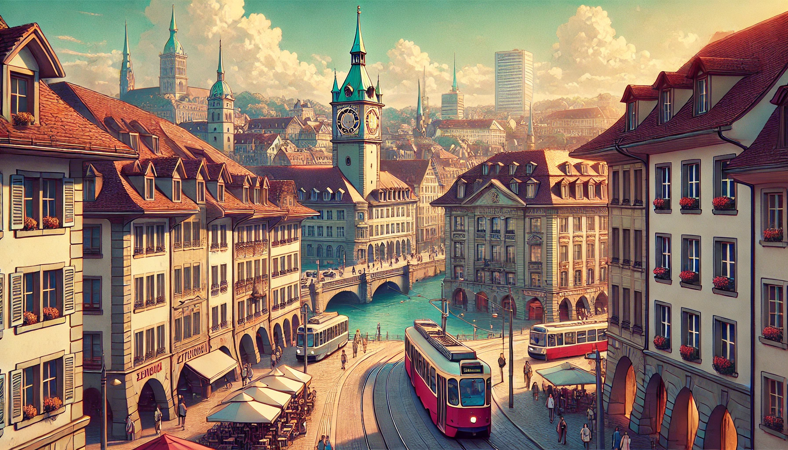
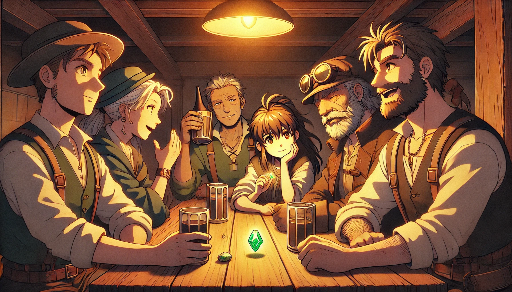
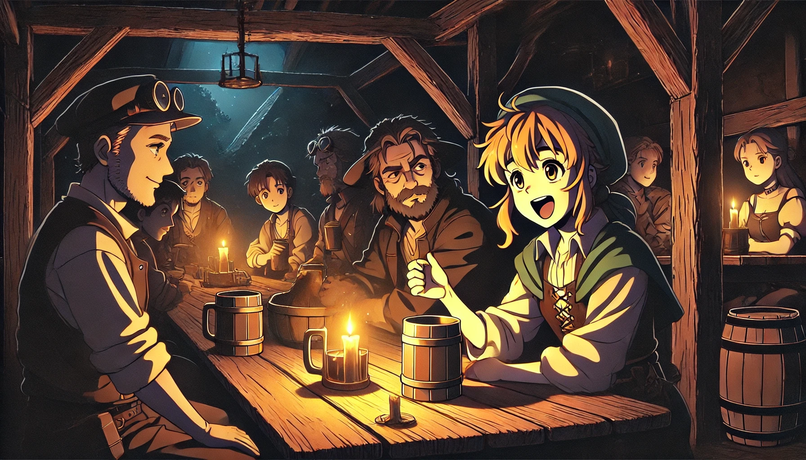
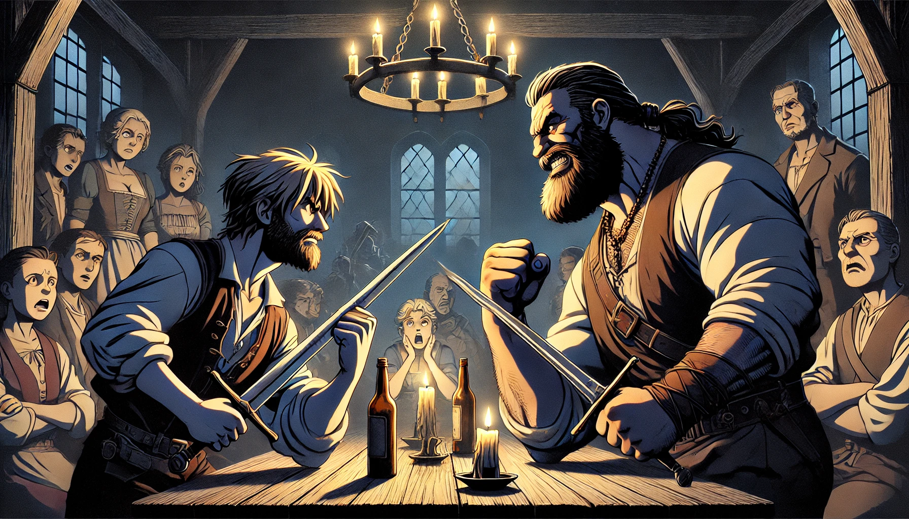
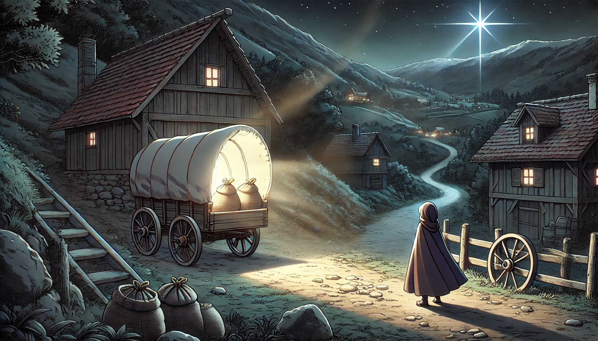

# 제1장: 베른(Bern)의 꺼지지 않는 촛불

   **_사랑하는 피터._**  

   **_할아버지는 먼저 베른(Bern)에 도착했다._**   

   **_크리스티앙 일행도 호주에서 출발했다고 하니, 예정대로 내일 저녁에 Cafe Marta에서 보자꾸나._**  

   **_그리고, 약속한 그건 꼭 들고 와야 한다._**  

   **_어차피 우리 집안이 기증한건데 잠깐 꺼내온다고 뭐 별일이야 있겠니?_**  

   
---

### 1.1. 마리아 (Maria)

   

"그거 한번 탁자위에 올려봐" 

"남들이 보면 어쩔려구요? 할아버지도 참..." 

"기념품인 줄 알겠지, 관광지 베른(Bern)에서, 더구나 이런 술집에서" 

"아이 참, Cafe Marta는 술집이 아니에요. 할아버지가 억지로 술을 시킨 것일뿐 하하" 총명한 눈빛을 가진 클라우디아(Claudia)가 할아버지의 어깨를 주물러 드린다.  

막 도착한 피터(Peter)는 의자에 대충 걸터앉아서 가방을 뒤져 부시럭 거리더니 테이블 위에 보석 하나를 올려놓았다. 할아버지가 오늘따라 조심성이 없다고 생각했다.  

순간 테이블이 환해질 정도로 영롱한 빛이 뿜어져 나온다. 

"이거 그냥 들고 나온거에요." 피터가 투덜거린다.

"참, 우리 집안 할머니들은 저 큰걸 어떻게 목에 걸고 다니셨데?"
클라우디아는 보석을 한번 스윽 만져본다.

"들키면 쎄른(CERN)에서 전 쫓겨나요. 얼마나 어렵게 얻은 직장인데 "  피터는 여전히 불만이 가득하다.  

할아버지는 피터를 힐끗 보며 가볍게 고개를 끄덕여 주었다. 

"대대로 광부였던 우리 가문에서 물리학 공부하는 과학자가 납셨다 이거지? " 

다른 손주들이 키득키득 거린다. 

"아이고 쫓겨나면 안되지 허허" 

맥주잔을 할아버지에게 건네며, 크리스티안(Christian)이 한마디 거든다. 

"저녀석은 책을 팠지만, 우리는 땅을 팠거든요." 
손자들은 저마다 목걸이, 귀걸이, 팔찌를 흔들어 보인다. 

"하지만 우리가 더 부자에요 하하"  
"보석사업을 여기까지 키워낸 것이 물리학보다는 더 어려울껄 피터?" 

스위스 베른의 조용한 밤거리. 
골목 한편에 자리 잡은 오래된 까페는 오늘날따라 유난히 활기가 넘쳤다. 
이미 오래 전에 이곳을 떠났던 마리아 가족의 후손들이 찾아와줘서 일까?  

주문했던 맥주가 테이블에 놓여지자 손녀 클라우디아(Claudia)는 입맛을 다시며, 긴 머리를 묶으려 고개를 들었다.  

올려다 본 맞은편 벽에서 그림 하나를 발견한다. 

"정말 저 그림에도 나오는네요. 똑같이 생겼어요" 

틀라우디아는 테이블 위에서 반짝이는 보석과, 벽에 걸린 그림 속에 그려진 보석을 번갈아 가며 본다.  

그림 속에는 커다란 힐버트 도끼를 든 거인이 있었고, 그의 갑옷 가슴 부분에는 큼지막한 보석이 빛을 발하며 박혀있다. 

"맘에 드냐?" 
할아버지가 일어서더니 그림의 좌우대칭이 맞는지 한번 더 살펴본다.  
"어제 이 카페를 인수하면서 제일 먼저 한 일이, 이 그림을 걸어놓는 것이었다"  

"네?" 맥주를 마시던 손자들의 입도, 화이트 소시지를 자르던 칼도 순간 멈췄다.

"여길 사셨다구요? 뭐하시게요?" 클라우디아는 할아버지가 딴 이야기로 넘어갈까봐 재빨리 끼어들었다. 

"옛날 이야기 해준다고 잠깐 보자고는 했지만, 이건 시작일 뿐, 나는 여기서 해야할 일이 제법 있어" 할아버지는 능청맞게도 피터가 자기 접시에 예쁘게 잘라놓은 화이트 소시지를 스윽 자기 접시에 덜어 담는다. "물론 잠은 피터네 집에서 잘거란다" 손자들은 계속 킥킥 거린다.

"할아버지, 사실 저는 안믿어져요." 피터가 퉁명스럽게 말을 던진다.

"우리가 어릴 적에 자장가 삼아서 듣던 이야기잖아요. 그게 어떻게 현실이 될 수 있어요? 우리가 애들도 아니고." 

재밌다는듯이 클라우디아의 큰 눈이 피터에게로 향했다가 할아버지에개로 간다. 클라우디아는 헛웃음을 참여 한손을 턱에 괴었다. 하지만 옆에 있던 다른 손자들은 의외로 할아버지의 입에서 눈길을 때지 않고 있다.

"오... 뭐야. 다들 집중하고 그래?" 클라우디아가 주변을 훑어보는데, 가장 나이 많은 손자인 크리스티앙이 입을 연다.

"안그래도 꼭 한번 물어보고 싶었어요. 대대로 보석일을 하고는 있지만  보석에 얽힌 전설이 가끔은 사실처럼 느껴질 때가 있었거든요. "

"물론 사실이지."  
거품서린 맥주가 할아버지의 목을 타고 들어간다. 

"모든 이야기는 여기 베른에서 시작됐지. 우리 집안 여자들에게만 반응하던 이 보석 말이야" 

할아버지는 보석을 어루만진다. 스스로 발광하는 빛은 어른거리며, 할아버지의 입가의 옅은 미소도 아련하게 보이게 만든다.  

그리고 벽에 걸린 오래된 그림을 다시 올려다 보며 조용히 입을 열었다. 손자들에게는 수백 번은 들었던 뻔한 전설이라지만 베른의 상쾌한 밤공기에 모든 것이 가능할 것만 같은 분위기다.  

--------------------------------
   

   

13세기의 베른(Bern)의 밤. 
오늘 밤처럼 여전히 고요했다. 

산골은 이미 어둑어둑하다. 방금 전까지 햇살이 비췄던 언덕길은 소금광산에서 나와 집으로 돌아가는 광부들의 발소리로 매꿔진다. 

고기 수프 냄새가 가득한 선술집에서 아빠는 양초를 바라본다. 깊게 패인 그의 주름이 촛불로 선명해진다.

"힘겹게 여기까지 왔는데 양초를 팔지도 않어. 망할 놈들..."그는 맥주를 반쯤 마셨다. 

"어차피 우리 형편에 비싼 물품이에요. 잊어버려요." 
엄마는 스프를 가볍게 들이키며 말했다.  
"우리 빈털털이에요. 로마에서 떠나올 때, 그많던 금화를 다 뺐기고..." 

"하나님을 섬기는 제국이라면서, 나쁜 짓은 골라서 하는거지" 빵을 뜯어 스프에 담그려다 아버지는 이내 내려놓는다. "광부일을 하면서 우리 가족들이 얼마나 많이 죽었는데. 그 많은 금괴, 은괴를 하나도 못가져가게 하고, 고작 단추로나 쓸 수 있는 저 돌맹이만 가져가라니 ..."
 

제법 예쁜 조약돌이 테이블 위에서 나뒹굴고 있다. 

이제 막 글을 배우기 시작한 마리아(Maria)와 한스(Hans). 신기한듯 돌맹이 주머니를 풀어 재치고 테이블에서 소꿉놀이를 하고 있다. 

"그래도 마리아의 외할머니, 형수님 두분이서 이쁜 돌이라며 모아놓았으니 망정이지. 이거라도 없었으면 어떡할 뻔 했어요? 그쵸 형수님?" 아빠보다 열 살 어린 안드레아(Andreas) 삼촌이 엄마를 거든다.

엄마는 웃으면서 고기를 담아 스프를 한 그릇을 아빠 앞으로 밀어두었다. 아빠는 애써 눈길을 주지 않으려 한다.  

"당신 참 답답하네. 양초없이 어떻게 광산에 들어간단 말이오?" 

아버지는 엄마에게 참다못해 역정을 내고는 이내 미안한듯 고개를 돌린다. 그리고 빵을 먹고 있는 마리아, 한스, 그리고 함께 따라온 그들의 조카들까지 하나 하나 찬찬히 훑어 보았다. 대략 열 명 남짓의 대식구. 

"이 많은 식구들을 먹여 살리려면 광부일을 해야해. 그게 아니면 ..." 아버지는 말을 이으려다 차마 그만둔다.

아버지는 남은 맥주 반잔을 마저 들이켰다. 엄마의 위로는 맥주 반 잔보다 못한 것 같았다. 

"형, 힘내요. 집 떠나온 우리 유대인들을 같은 동네에 살게 해준 것만 해도 어디에요. 감사하게 생각해요" 안드레아 삼촌이 아빠의 손을 잡아준다.

"여기서 자리를 잡지 못하면 안드레아랑 같이 용병으로 나갈테니 그렇게 알어" 아빠도 삼촌의 손을 맞잡았다. 둘은 서로를 눈을 피하지 않고 한참을 평온하게 바라보았다.

"용병으로 가서 살아남은 사람이 있던가요? 애 앞에서 무슨 말을 하는거에요 지금" 
식구들 전체가 갑자기 침묵에 빠진다. 

고사리 손으로 조약돌 장난을 하던 마리아는 아빠의 눈치를 슬슬 살핀다. 아직 어리기만한 마리아와 한스는 조약돌을 계속 가지고 놀면서도 눈물이 그렁그렁 맺힌다. 마리아는 동생 한스가 울지 않도록 감싸 안은 후, 고개를 숙이고 조약돌을 손에 꽉쥐었다. 

"무책임한 아빠로 사는 것 보다는 낫지않소" 담담한 아빠의 목소리가 귀에 들어오자 마리아의 두 볼을 타고 흐르던 눈물이 조약돌 위로 떨어진다.

"아빠 ! 그리고 삼촌 !" 마리아가 갑자기 일어서더니 보석자루를 흔들면서 해맑게 웃었다. 낙천적인 성격의 마리아는 늘 그랬듯이 아빠와 눈을 맞추며 활짝 웃어보인다.

"이거 제가 다 팔아 볼께요. 나귀 등에 가득 싣고 왔으니, 다른 마을에 가서 양초로 바꿔오면 되죠 ! "   

   

쾅 !  

갑자기 선술집이 흔들린다.  
큰 덩치 하나가 선술집의 문에 꽉 낄듯이 들어온다. 문이 여기저기서 신음소리를 낸다.  

"오 ! 막시밀리앙(Maximilian). 오늘은 뭐 좀 건졌어?" 

"힘좋다고 이것 저것 다 캐가는 것 아닌가? 우리 것도 좀 남겨놔야지. 맥스" 

"예들아, 맥스가 왔어. 큰 통에 맥주 담아와라"  

맥스라 불리는 덩치는 가게를 훑어보니디 일부러 아빠 옆자리에 앉고, 테이블 위에 두툼한 손을 올려둔다. 테이블이 신음소리를 낸다. 

"아까 채굴장 앞에서 양초 달라고 꼬장 부리던 유대인 놈이구만" 맥스가 비웃는 표정으로 아빠의 옆얼굴을 보고 있다. 

"니가 새로 광산을 파던 말던 상관없어. 하지만 양초는 내 허락없이는 이 동네에 들여오면 안돼." 맥주가 나오자 맥스는 단숨에 마셔버린다. 

"체링겐 대공에게 면허를 받은 유일한 캔들러(chandler)는 나밖에 없어. 어디 세금 한푼 안내는 너같은..." 

말이 끝나기도 전에 엄마는 비명을 질렀다. 무표정한 얼굴로 아빠는 일어서더니 들고 있던 맥주잔으로 가게에 있는 양초를 하나씩 찍어눌러서 부수고 있다. 

"이런 미친 놈이...여기는 내 가게야. 너는 양초값을 변상할 돈은 있냐? " 맥스는 칼집에서 칼을 꺼낸다. 그리고는 이글거리는 눈빛으로 테이블을 뒤집어 엎어버렸다.  

"결투에서 날 이기면 내가 양초값은 안받지"  

맥스는 벽에 걸린 칼 하나를 아빠에게 던진다. 엄마는 이미 기절했고, 아빠에게 달려가려는 마리아와 한스를 안드레아 삼촌이 붙잡고 있다. 울부짓는 마리아의 큰 두눈은 퉁퉁부어 올랐다.   

맥스는 한 팔로 가볍게 아빠를 구석으로 밀어버렸고, 이윽고 그의 칼이 하늘로 솟구친다.  

그 순간 밝은 불빛이 뒤에서 날아와 맥스의 칼에 반사되어 맥스의 눈을 찔렀다. 화가난 맥스가 목이 꺽어질듯이 뒤를 돌아본다. 

. 
. 
. 
. 

사람들도 그곳을 응시한다.   
촛불이 꺼져서 어두워진 선술집이 갑자기 환하게 밝아졌기 때문이다. 

사람들의 웅성거림 속에 대낮같이 밝게 빛나는 무언가를 들고 있는 사람의 형체가 서서히 나타난다.   

마리아였다.  
안드레아 삼촌이 보호한답시고 벽감 안쪽까지 밀어넣어던 마리아였다.

뿐만 아니었다.  
테이블 위의 조약돌도 촛불보다 더 밝게 빛나고 있었다. 

"아저씨, 이걸로..."

"이걸로... 촛불대신에 쓰시면 안될까요?" 
퉁퉁 부어오른 큰 눈의 마리아.  
맥스를 올려다 보며 해맑게 웃고 있다. 

"무슨 짓을 한거냐?" 

선술집 밖으로 헐레벌떡 도망나온 엄마도, 삼촌도, 그리고 사촌들까지도 모두 놀란 눈이 되었다. 어쩔 줄을 몰라 울먹이는 마리아를 엄마는 꼭 안아주었다. 

엄마 등에 업혀서 서둘러 돌아온 집. 
엄마가 잠든 마리아를 깨운다. 

"마리아" 

"...엄마, 죄송해요. 조약돌 때문에 그러시는거죠?" 

"조약돌이 문제가 아니란다"  

목이 말랐는지 엄마는 물잔을 한 손에 들고, 주전자를 찾으러 여기저기 해매다가 잠깐 멈췄다. 창을 열고 하늘을 올려다보며, 한참 만에 입을 연다. 

"어쩌면 네가 문제일 수도 있어." 

커텐이 바람에 날리며 드러난 달빛에, 엄아의 얼굴에서 낯선 미소가 보인다.

"늦었지만 지금 할머니에게 꼭 갔다오렴" 

외할머니는 바로 옆 언덕 위에 있는 오두막 집에 혼자 사신다. 마리아의 다음 대답을 이미 알기에 엄마는 덧붙인다. 

"자고 와도 좋아" 

식구들이 깨지 않도록 뒷문으로 집밖을 나온 마리아. 망토를 덮어쓰고 밤길을 밝힐 횟불을 가지로 마굿간으로 항했다. 

하지만 몇 걸음을 움직이기도 전에 걸음을 멈추고 말았다.  

마굿간 옆에 세워둔 마차 안에서 가득한 조약돌 주머니. 그 주머니들이 온통 빛을 뿜으며 길거리를 환하게 비추고 있었다.

"양초로 바꾸지 않아도 되겠어"  

   

