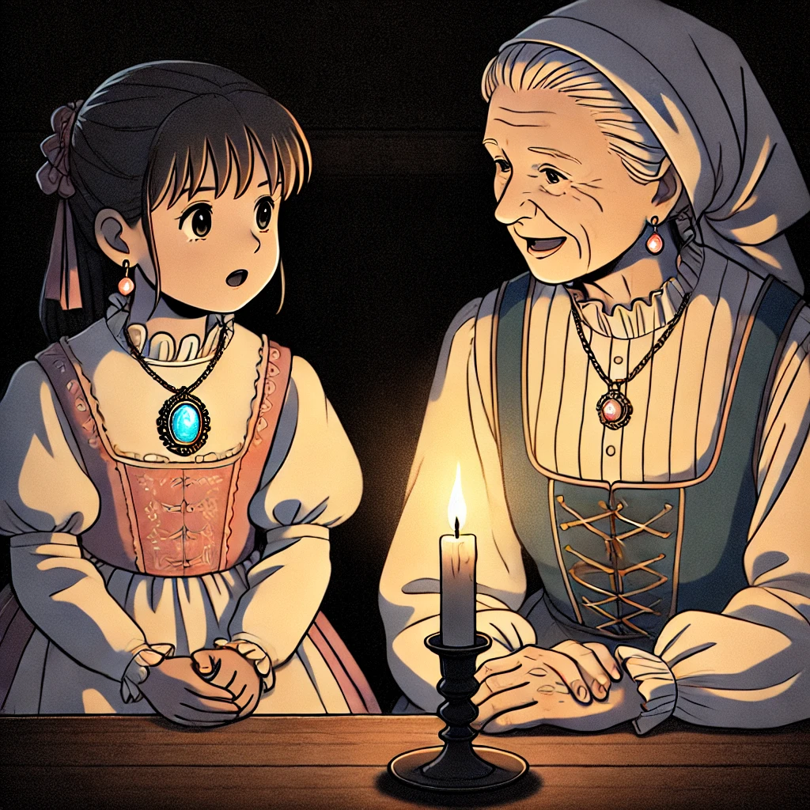

### 1.2. 세자르(Cesar)
   

   

그렇게 마리아가 할머니 집에 가고, 엄마는 마리아 방에서 한숨도 자지 않고 기다렸다. 

새벽이 가까워 올 무렵, 엄마는 외할머니 댁에 들렸다. 그리고 문틈 사이로 들려오는 두 사람이 아직도 이야기하는 것을 보게 되었다. 

할머니는 미소 가득한 얼굴이었다. 

"나도 물려받은 목걸이가 너한테 이렇게 잘 어울릴 줄은 몰랐구나" 

방안이 온통 목걸이의 보석이 뿜는 광채로 환하다. 

“나한테는 그냥 갑싼 목걸이지만 너는 그힘을 꺼낼 수 있구나.” 

마리아는 할머니의 말을 믿을 수 없었지만, 그녀의 손 안에 있던 보석은 여전히 빛나고 있었다. 

"더 이야기 해주세요" 

"옛날 이야기인데 더 들어서 뭐할려구. 너는 이야기를 만들어 가야할 사람이란다. 우리 아기 하하" 

어느새 밤은 지나고 베른의 아침이 밝아오고 있었다. 
 
