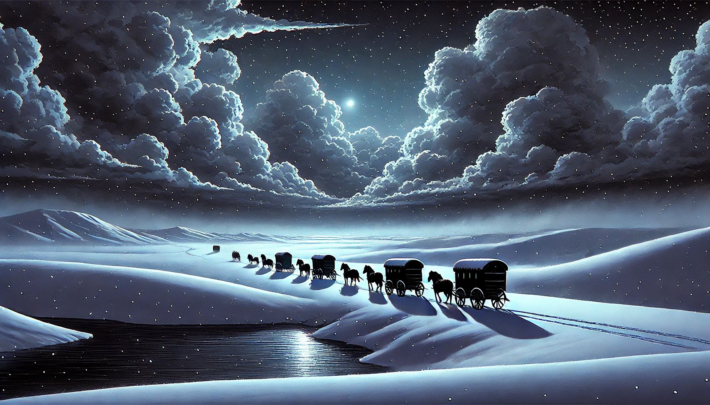

# 3. The Eternal Candle of Bern  
   

   

Dawn, November 2, 1313. 
On the road to Bern, Switzerland.  

Through the snowstorm, across the highlands where the cold air of Lake Murten (Murtensee) lingers,  
a caravan of carriages can be seen making its way.  

"Maria's fever is getting worse."  
Her mother tenderly cools Maria's burning forehead.  
Though she's grown considerably taller in recent months as puberty approaches,  
her parents still cherish her like a baby.  

Her father, listening silently, doesn't turn his head.  
"Just hold on a little longer. We'll reach Bern in a day."  

At the head of the caravan is Maria's family, followed by their cousin's families.  
The end of the procession is marked by carriages loaded with noisy cargo pouches.  

"Why did we bring those stone chunks, making this journey so difficult..."  
"Dear... your mother might hear you."  

After searching everywhere for the kettle, she paused briefly.  
Opening the window and gazing up at the sky, she finally spoke after a long moment.  

"Perhaps you're the issue."  
As the curtains billowed in the wind, an unfamiliar smile appeared on Mother's face in the moonlight.  

"Though it's late, you should visit your grandmother now."  

Her grandmother lives alone in a cottage on the hill right next door.  
Already knowing Maria's next response, her mother added:  

"You can stay overnight if you'd like."  

Maria left through the back door to avoid waking the family.  
Wrapping herself in a cloak and taking a torch to light the night path, she headed toward the stable.  

But she stopped after just a few steps.  

The pouches of pebbles stored in the carriage by the stable were all emitting light, illuminating the street brightly.  
 

   

[Read Next](1-01_(EN)maria_2.md) 