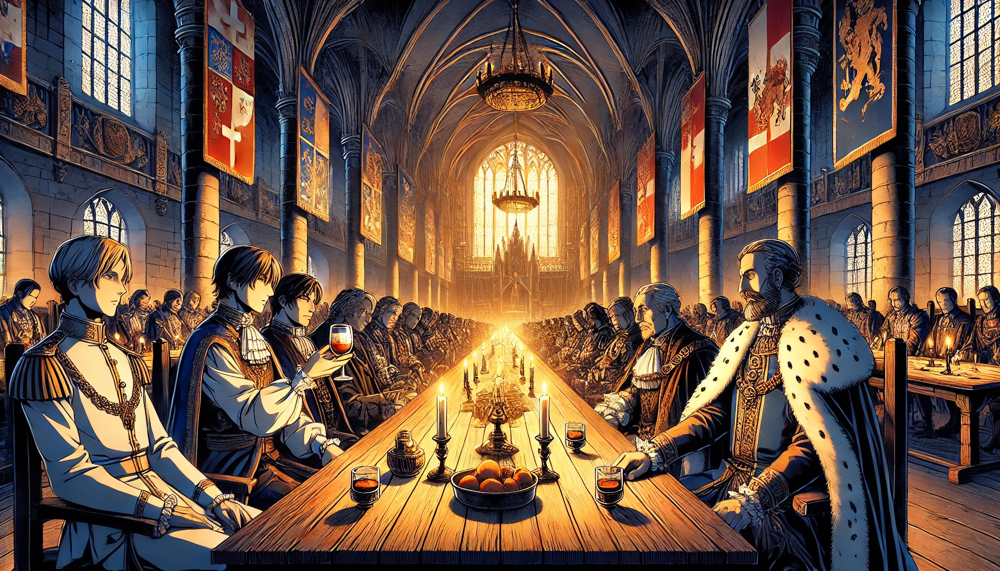

# 5. Cesar  
   

   

'The Empire needs strength, Cesar' 

Leopold I of the Habsburg dynasty confides his frustrations to Cesar.  

"I understand."  
Cesar pours wine into a glass at the banquet hall and offers it to Duke Leopold.  

"Though I've settled in a small Swiss village,  
how could I not understand Your Highness Leopold's desire to oversee the entire empire as the legitimate heir of the noble House of Habsburg?  

Leopold is weak to flattery.  
"Indeed, you understand me well.  
While West Francia unifies and grows stronger as an empire, our East Francia remains divided.  
This keeps me awake at night."  

As the Emperor finishes speaking, Cesar slowly turns around.  

'We have plenty of power'  

[Continuing translation...] 