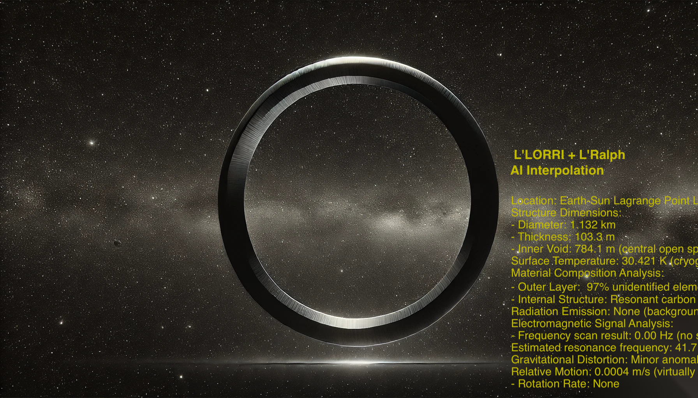
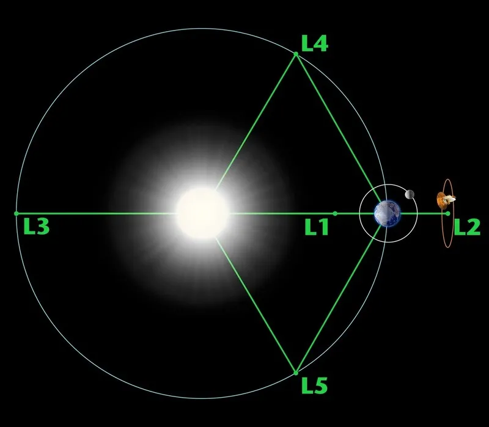

# 1. The Ring
   

December 1, 2031, 8:13 a.m. (Eastern Standard Time)  
NASA Goddard Space Flight Center,  
Greenbelt, Maryland, MD 20771, USA  

Morning sunlight streams gently through the windows.  
Monitors all around display videos tracking the orbit of the asteroid probe Lucy.  

Inside the spacious control center, the Beatles’ Lucy In The Sky With Diamonds plays softly.  

Cellophane flowers of yellow and green  
Towering over your head  
Look for the girl with the sun in her eyes  
And she's gone  
Lucy in the sky with diamonds  
Lucy in the sky with diamonds  
Lucy in the sky with diamonds  

diamonds  
diamonds...  
Its chorus repeats in a dreamlike echo.  
Nevertheless, Center Director Alan Kennedy can’t help but wake up.  

Bang.  
A burly man pushes open the door and, stumbling over some stacked supplies, knocks them down.  

“Good grief... Andrew.”  
Kennedy puts his glasses back on, glancing behind him.  
“Those items look a bit damaged—hope they weren’t expensive?”  
The big man, who nearly fell over but managed to regain his balance, smiles sheepishly.  
Unlike everyone else, he’s dressed in casual clothes.  
A badge around his neck identifies him as part of the aerospace startup De Morgan, Inc.  
Andrew Levi, an astrophysicist and CTO.  

“You stayed up all night again, didn’t you? It’s been a month of this.”  
He waves a plastic bag containing coffee and donuts in both hands.  
“You’ll ruin your health at this rate, Dr. Kennedy. Let’s get some breakfast!”  

“Living alone at your age, skipping meals—that’s a fast track to dementia. Haha.”  
Kennedy doesn’t even turn around; he simply points toward a seat a few rows ahead.  
“Oh? There’s an operator there too? I brought plenty of donuts—no worries.”  
A blonde operator is already fast asleep.  
Both of them look utterly exhausted.  

Andrew hands a donut and coffee to each of the two.  
Kennedy and the operator rub their eyes and start eating.  

“So, it’s been how many years since Lucy first launched, and now it’s back on track to Earth?”  
“It was launched toward Jupiter around the year you graduated, 2021, so nearly a decade ago.”  
“And instead of returning home, it’s pulled off course over there… Strange.”  
“That’s the Lagrange Point L4. We’ll reach it in half a day, so we’ll find out soon enough.”  
“That place is teeming with asteroids. Looks like our billion-dollar probe is about to become scrap.”  

Kennedy sighs, as though resigned, and takes a bite of his donut.  
He chews, swallows, then speaks into his headset.  
“Enlarge the predicted path and capture some images.”  

The operator activates Lucy’s L’LORRI camera.  
On the predicted path, there’s nothing but empty space and distant stars.  
Although, off that trajectory, you can vaguely see some large asteroids.  

“What exactly is it after? There’s nothing out there.”  
Kennedy continues to watch, baffled.  

“It could be something too small for the camera’s resolution.”  
Andrew offers gently.  

“C’mon, youngster, can’t you think of something more imaginative?”  
Kennedy counters with a hint of sarcasm.  

“Well...”  
Andrew pulls another donut from the bag  
and uses it to block the incoming sunlight through the window.  
Light slips through the donut hole, shining on Andrew’s face.  

“Maybe it’s a donut-shaped structure with a hole in the middle.”  
A moment of silence passes as everyone looks at him.  
“If that were the case, it’d be nearly impossible to distinguish from starlight behind it.”  

Kennedy suddenly spits out the donut he was chewing and flips on his headset.  
“Operator? L’LORRI is running, right? Widen the field of view a bit.”  
Several-kilometer-wide asteroids now fit in the same frame.  
“Can we also activate L’Ralph? Crank up the sensitivity and apply the infrared filter.”  
After a short wait, data arrives.  
“Okay. Overlay the thermal pattern on the original image.”  
Infrared heat patterns appear on top of the photo.  

“All right, time for a bit of hidden-picture fun.”  
Kennedy compares the original and filtered images on two monitors.  
“I might beat you to it, Doctor.”  
The operator uses AI to extract areas showing significant differences.  

“Hold on... Huh... What is that? Zoom in on Section 45 of the FOV.”  
As the view zooms in, a faint circular shape appears.  
“That’s awfully round.”  
Andrew murmurs, intrigued.  

“AI correction in progress.”  
The operator looks at the monitor.  

“Oh...”  
All three exhale in a low, astonished murmur, practically in unison.  

   

It’s a gigantic ring.  
Kennedy removes his glasses and stares intently at the central monitor.  

“Who… are… you?”  
He can’t even close his gaping mouth.  

Data continues streaming in.  
Its diameter is about 1 km,  
with a thickness of around 100 meters, shaped like a thin donut.  
The temperature hovers near 30 Kelvin,  
indicating some faint heat source inside.  

“In other words, this is an artificial structure… That’s what we’re seeing.”  
Kennedy expresses amazement as he reads the analysis, line by line.  
The operator, similarly curious, asks,  
“Doctor, we’ve scanned that region before. How did we miss this?”  

Kennedy inputs additional data, testing one hypothesis after another.  
“Is Lucy still sending data in real time?”  
“Yes, I’m pulling all of it, including system logs. I’ll put them on the main monitor.”  

Most logs detail communications between Lucy and us here at Goddard.  
But in between are chunks of unfamiliar data.  
They begin erratically, then gradually learn our communication protocols, showing exchanges in and out.  

“Clever. It’s been studying how we talk.”  
Kennedy grins.  
“So after it figured out how we communicate, it enticed Lucy over to that ring.”  
Andrew checks the monitor.  
“Not brute force, but coaxing with words… This is a fun discovery. Haha.”  

After a moment’s pause, Andrew says,  
“Or perhaps it just wanted to know if we could talk to each other.”  
Kennedy halts, as though struck, and exhales.  
“Ah...”  

Andrew rushes to his seat and puts on a headset.  
“Operator, open Port 3 for me.”  
“Port 3 open. You’re linked to Lucy.”  

The main monitor in the center mirrors Andrew’s screen in real time.  
“What should we call this?”  
“Let’s just call it ‘the Ring’ for now.”  
Andrew pauses, then simply types a short greeting.  

“Hi, the Ring”  
From Earth to L4 and back again takes about 19 minutes round trip.  
Anxious anticipation fills the silence as they wait.  

“A...”  
“A...”  
Weak signals cause the monitor to flicker. It’s unclear if it’s just noise.  

“Operator, we’re getting a signal. Boost sensitivity and filter out the noise.”  
“On it.”  

“Ar...”  
Kennedy and Andrew’s eyes widen.  

“Are you talking to me?”  
Lucy’s comm log clearly shows the response.  

.  
.  
.  
.  

An extended silence.  
All three look at one another, speechless.  

“Operator, where exactly is that signal originating?”  
Kennedy asks, voice trembling.  
“It’s coming from the Ring. Lucy just picks it up and relays it to us.”  
The operator jumps up and points to the front monitor.  
“See the graph on Monitor 2?”  

As Lucy draws closer to the Ring,  
it sends back a deluge of structural and material data on the Ring.  
“It’s like the Ring is pulling Lucy in to show it off: ‘Look, I’m right here.’”  

Kennedy hurriedly calls Human Resources.  
“Tell everyone coming in to turn around and go home.”  
He then pulls out a walkie-talkie for Security.  
“Seal the control center. Not a soul in or out, got it?”  

Taking a deep breath, Kennedy makes another call.  
“What you said would happen… has happened. I need you here right away.”  

In less than an hour, two individuals in black suits enter.  
They introduce themselves as agents from the United States Director of National Intelligence,  
and proceed to erase the CCTV records.  

“Apart from you three, does anyone else know about this?”  
They double-check the monitors.  

“How about some coffee and donuts?”  
Andrew greets them warmly.  
They’re the ones who recommended him for the Lucy Return Project—  
a huge honor for a thirty-something scientist fairly new to the field.  

Without a word, the agents sit at the computer desk and bring up analysis screens.  
“Lucy isn’t the only one heading to the Ring.”  
“What???”  
“There's a faint energy signal originating from Earth. It’s also going to the Ring.  
We’ll show you the signal intercepted by the NSA.”  

Zooming in on the map, they arrive at a café in the old town of Bern.  
Street view shows a sign reading cafe Marta.  
“Huh… that place...”  
“Your family owns it, right? They’ve held the title for generations.”  
“Yes, it’s inherited by the eldest on condition it’s never sold. I recently became the owner.”  
“You haven’t seen the basement, have you?”  
“The basement? No...”  

One agent smirks, pulls a radiant jewel from his bag, and holds it out.  
“Take a look at this.”  
It glimmers with a deep blue light—less a reflection, more of an inner glow.  
“That café’s basement is cleverly hidden.  
You’d be astonished at the sheer volume of gemstones down there.  
When the NSA first picked up the signal, they thought it was some spy transmission, but they traced it here.”  

Returning the jewel to his bag, the agent continues:  
“We initially suspected the Ring would be at Lagrange Point L4.”  
“How did you know?”  
“Check out this image we found down in that basement.”  
He projects the picture onto the main monitor.  

“Ah...”  
Everyone gasps in awe.  

“That’s a portrait of Maria Levi, an ancestor of yours.  
Imagine her face as the Sun.  
Her hands are precisely at the Lagrange Points.  
In her palms, there’s a ring drawn.  
And if you’re looking at the painting, you’re positioned where Earth would be.”  

Silence reigns for a moment.  

“In the basement of cafe Marta, there are countless volumes chronicling these legends.  
They’re no mere myths now, but proven realities.”  

“All right, Dr. Levi, please come with us.  
We’ve prepared a project for you to lead.”  
The agents hurry him along, packing documents and bags, then waiting at the door.  

Kennedy can’t close his mouth, struck speechless.  
Andrew, initially taken aback, calmly gathers his belongings.  
He looks up at the central monitor, which still displays his grandmother Maria’s portrait.  

He glances at the donut-shaped stigmata in each of her hands,  
then at the Ring on the monitor beside it.  

Steeling himself, Andrew steps toward the door with the agents.  

“Lucy is about to reach the Ring. Initiating reverse thrust.”  
The operator reports.  

Lucy’s reverse-thrust system fires.  
They pause to watch the monitor.  

“Wait...? The Ring’s center is lighting up!!!”  
The operator’s voice quivers with alarm.  

Though the Ring is shaped with an empty center,  
red flames begin to flicker at that midpoint,  
then rapidly condense into a massive sphere of blue light.  

“My God… The Ring must be interpreting Lucy’s reverse thrust as a hostile act.  
It’s going to destroy Lucy. Stop the reverse thrust, now!”  
Andrew shouts, but it’s too late.  

A brilliant flash floods the screen,  
followed by a deafening roar, and every monitor abruptly goes dark.  

   

* [View Table of Contents](content_en.md)  
* [Read the Next Part](/01_gemston/EN/EN_2.md)
