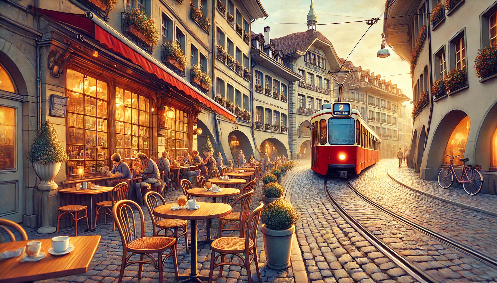

# 2. 앤드류 레비 박사의 귀향  
   

더링을 발견한 후 40년 뒤,  
스위스 베른(Bern) 

.  
.  
.  

   

"사랑하는 피터.  
이 할애비는 이미 이달 초에 베른(Bern)에 도착해서,  
여기저기 좀 둘러보고 있단다.  

아비게일(Abigail) 일행도 호주에서 출발했다고 하니,  
예정대로 내일 저녁에 Cafe Marta에서 보자꾸나.  

잼스톤(GemSTON) 표본은 꼭 들고 와야 한다.  
어차피 우리 집안이 기증한건데 잠깐 꺼내온다고 뭐 별일이야 있겠니?"  

.  
.  
.  

피터(Peter Levi)는 메신저 앱을 다시 확인하면서 cafe Marta로 들어선다.  

"예약자 성함이?"  
"앤드류 레비(Andrew Levi). 덩치 좋으시고 흰수염을 기르신 할아버지에요"  
"아, 저기 지하 저장고 입구쪽에 있는 테이블이에요. 이미 다들 와 계십니다."  

"할아버지 !!!"  
피터는 달려가서 할아버지를 껴안는다. 

이제는 할아버지라고 불리는게 자연스러운 나이가 된 앤드류 레비 박사.  
그도 이 많은 손자들을 다 같이 보는게 얼마만인지 모른다.  

세계 여기저기에 흩어져 사는 손자들도, 서로 오랫만에 보는지라  
한동안 서로 끌어안고, 입을 맞추고 난리 법석을 떨었다.  

레비 박사는 대뜸 물었다. 
"너 그거 가져왔지? 탁자위에 올려봐" 
"남들이 보면 어쩔려구요? 할아버지도 참..." 

"기념품인 줄 알겠지, 관광지 베른(Bern)에서, 더구나 이런 술집에서" 
"아이 참, Cafe Marta는 술집이 아니에요. 할아버지가 억지로 술을 시킨 것일뿐 하하"  
총명한 눈빛을 가진 아비게일(Abigail)은 할아버지의 어깨를 주물러 드린다.  

막 도착한 피터는 의자에 대충 걸터앉아서 가방을 뒤져 부시럭 거리더니 테이블 위에 보석 하나를 올려놓았다.  
피터는 속으로 할아버지가 오늘따라 조심성이 없다고 생각했다.  

순간 테이블이 환해질 정도로 영롱한 빛이 뿜어져 나온다. 

오오오... 

   

"아직도 분석 중인 샘플이라서, 허락도 안받고 그냥 들고 나온거에요."  
피터가 투덜거린다. 
"참, 우리 집안 할머니들은 저 큰걸 어떻게 목에 걸고 다니셨데?" 
아비게일은 보석을 한번 스윽 만져본다. 

"들키면 쎄른(CERN)에서 전 쫓겨나요. 얼마나 어렵게 얻은 직장인데 "  
피터는 여전히 불만이 가득하다.  
레비 박사는 피터를 힐끗 보며 가볍게 고개를 끄덕여 주었다. 
"미안하다. 분석할 수 있는 고출력 싱크로트론이 우리쪽에는 없어서 너한테 분석을 부탁한거니까, 잘 좀 분석해줘." 
피터가 고개를 끄덕였다. 
"그리고 피터. 알지? 실험은 항상..."
레비박사가 윙크를 주자, 피터가 대답한다.
"비공식적으로"

"으휴, 대대로 광부였던 우리 가문에서 물리학 공부하는 과학자가 납셨다 이거지? " 
다른 손주들이 키득키득 거린다. 
"아이고 쫓겨나면 안되지 허허" 
맥주잔을 레비 박사에게 건네며, 크리스티안(Christian)도 한마디 거든다. 

"저녀석은 책을 팠지만, 우리는 땅을 팠거든요." 
손자들은 저마다 목걸이, 귀걸이, 팔찌를 흔들어 보인다. 
"하지만 우리가 더 부자에요 하하"  
"보석사업을 여기까지 키워낸 것이 물리학보다는 더 어려울껄 피터?" 

스위스 베른의 조용한 밤거리. 
골목 한편에 자리 잡은 오래된 까페는 오늘날따라 유난히 활기가 넘쳤다. 
이미 오래 전에 이곳을 떠났던 마리아 가족의 후손들이 찾아와줘서 일까?  

주문했던 맥주가 테이블에 놓여지자  
아비게일은 입맛을 다시며, 긴 머리를 묶으려 고개를 들었다.  
그런데, 올려다 본 맞은편 벽에 걸려있는 그림들을 발견한다. 
아비게일은 다가가서 그림을 자세히 살펴보았다. 

왼쪽 그림에는 커다란 힐버트 도끼를 든 거인이 있었고,  
그의 갑옷 가슴 부분에는 큼지막한 보석이 빛을 발하며 박혀있다. 

아비게일은 테이블 위에서 반짝이는 보석과,  
벽에 걸린 그림 속에 그려진 보석을 번갈아 가며 본다.  
같은 종류의 보석이라 것이라는 것을 깨닫는다.  

오른쪽 그림에는 중세시대의 소녀 그림이 있었다. 
"이건 전설 속의 마리아 할머니 그림인가요?" 
아비게일은 레비 박사에게 물었다. 
"그렇단다."
"진짜 오래된 그림 같아 보여요."  
"천년 가까이 된 것이지. 우리 레비 가문 대대로 내려오는 그림이란다." 

레비 박사도 일어서서 그림쪽으로 다가오더니   
그림의 좌우대칭이 맞는지 한번 더 살펴본다.  

"마리아 할머니 손바닥에 구멍뚫린 동전같은 자국은 뭐에요?" 
이번에는 피터가 물었다.  

레비 박사는 대답 대신에, 딴 이야기를 꺼낸다.  
"어제 이 카페를 인수하면서 제일 먼저 한 일이, 이 그림을 걸어놓는 것이었다"  
"네?"  
맥주를 마시던 손자들의 입도, 화이트 소시지를 자르던 칼도 순간 멈췄다. 
"건물이야 원래 할아버지 것인데, 임대해준 까페를 아예 사셨다구요? 뭐하시게요?"   
아비게일은 레비 박사가 딴 이야기로 넘어갈까봐 재빨리 끼어들었다. 

"옛날 이야기 해준다고 잠깐 보자고는 했지만, 이건 시작일 뿐, 이 할애비는 여기서 해야할 일이 제법 있어"  
레비 박사는 능청맞게도 피터가 자기 접시에 예쁘게 잘라놓은 화이트 소시지를 스윽 자기 접시에 덜어 담는다.  
"물론 잠은 피터네 집에서 잘거란다"  
손자들은 계속 킥킥 거린다. 

"할아버지. 전화로 설명을 해주셨지만 사실 저희는 안믿어져요."  
피터가 퉁명스럽게 말을 던진다. 
"우리가 어릴 적에 자장가 삼아서 듣던 이야기잖아요. 그게 어떻게 현실이 될 수 있어요? 우리가 애들도 아니고." 

재밌다는듯이 아비게일의 큰 눈이 피터에게로 향했다가 레비 박사에개로 간다.  
아비게일은 헛웃음을 참여 한손을 턱에 괴었다.  
하지만 옆에 있던 다른 손자들은 의외로 레비 할아버지의 입에서 눈길을 때지 않고 있다. 

"오... 뭐야. 다들 집중하고 그래?"  
아비게일이 어이없다는듯이 주변을 훑어보는데, 가장 나이 많은 손자인 크리스티앙이 입을 연다. 
"안그래도 꼭 한번 물어보고 싶었어요. 대대로 보석일을 하고는 있지만 보석에 얽힌 전설이 가끔은 사실처럼 느껴질 때가 있었거든요. " 

"물론 사실이지."  
거품서린 맥주가 레비 박사의 목을 타고 들어간다. 

"모든 이야기는 여기 베른에서 시작됐지. 우리 집안 여자들에게만 반응하던 이 보석 말이야" 
레비 박사는 보석을 어루만진다.  
스스로 발광하는 빛은 어른거리며, 70세를 넘긴 레비 박사의 입가의 옅은 미소도 아련하게 보이게 만든다.  

그리고 벽에 걸린 오래된 그림을 다시 올려다 보며 조용히 입을 열었다.  
손자들 입장에서는 수백 번은 들었던 뻔한 전설이지만,  
베른의 상쾌한 밤공기에 모든 것이 가능할 것만 같은 분위기다.  

   

* [목차 보기](content_kr.md)  
* [이전 편 읽기](/01_gemston/KR/0-01_(KR)the_ring_1.md)
* [다음 편 읽기](/01_gemston/KR/1-01_(KR)maria_1.md)