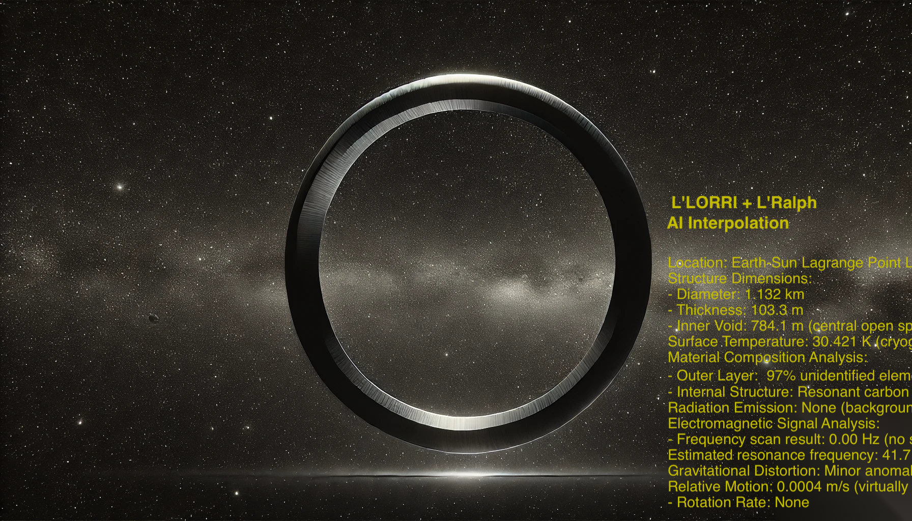
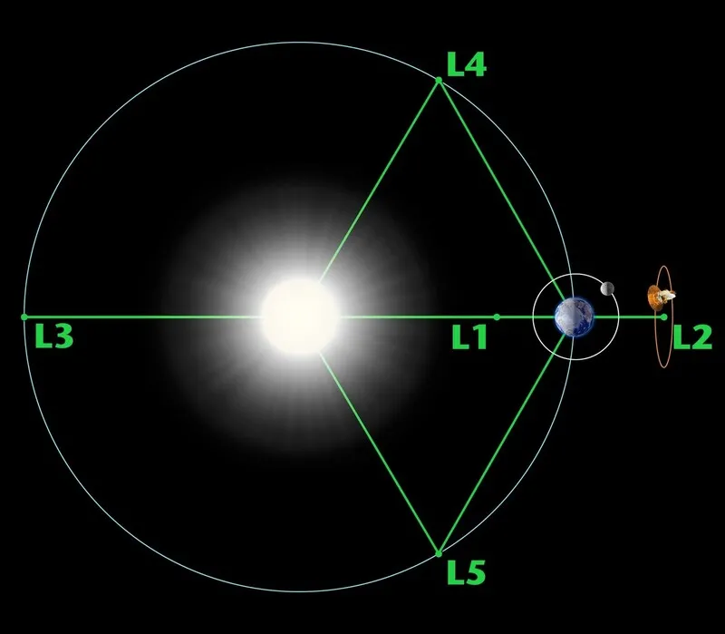

# 1. The Ring
   

December 1, 2031, 8:13 a.m. (Eastern Standard Time)  
NASA Goddard Space Flight Center (GSFC),  
Greenbelt, Maryland, MD 20771, USA  

Morning sunlight shone through the windows.  
Throughout the control center, every monitor displayed live feeds tracking the orbit of the asteroid probe Lucy.  

In that wide operations room, The Beatles’ “Lucy In The Sky With Diamonds” played softly.  

Cellophane flowers of yellow and green  
Towering over your head  
Look for the girl with the sun in her eyes  
And she's gone  
Lucy in the sky with diamonds  
Lucy in the sky with diamonds  
Lucy in the sky with diamonds  

diamonds  
diamonds...  
The chorus echoed as if in a dream,  
yet Dr. Alan Kennedy, the center director, had no choice but to wake up.  

Thud.  
A large man barged in, pushing the door and toppling stacks of supplies.  

“Darn it… Andrew.”  
Kennedy put his glasses back on, glancing behind him.  
“Some of this equipment looks fragile. Hope it isn’t expensive?”  
Nearly losing his balance, the big man managed to straighten up with an embarrassed grin.  
Unlike the others, he wore casual clothes.  
A badge around his neck read De Morgan, Inc., an aerospace startup.  
He was Dr. Andrew Levi, astrophysicist, CTO.

“You’ve been up all night again, haven’t you? It’s been a month now,”  
he said, waving a plastic bag holding coffee and donuts.  
“If you keep skipping breakfast, you’ll make yourself ill, Dr. Kennedy. Let’s take a break!”  

“A single old bachelor skipping meals… surest path to early dementia, haha.”  
Kennedy ignored him, merely pointing a finger at the row of seats up front.  
“Oh? We have an operator here too? Don’t worry, I brought plenty of donuts.”  
The blonde operator was already slumped over, sound asleep.  
Both looked utterly worn out.  

Andrew handed a donut and coffee to the two.  
Kennedy and the operator rubbed their eyes while they ate.  

“So, how many years had it been since Lucy was launched? Now it’s finally coming back to Earth?”  
“It was fired off toward Jupiter in 2021—the year you graduated—so nearly a decade.  
But it’s now getting pulled off over there…”  
“Lagrange Point L4, half a day’s journey. We’ll find out soon enough.”  
“That region’s jammed with asteroids. Looks like we’ve wasted a billion dollars on that probe.”  

Kennedy, resigned, took a bite of donut.  
He chewed, then spoke into his headset.  
“Magnify the predicted path and start filming.”  

The operator powered up Lucy’s L’LORRI camera.  
But the projected route showed little more than empty space and shimmering stars.  
Off to the side, you could see some large asteroids, but that was it.  

“What’s it aiming for? There’s nothing out there,”  
Kennedy muttered, perplexed.  

“It might be something smaller than the camera’s resolution,”  
Andrew offered.  

“Kid, can’t you be more creative?”  
Kennedy retorted drily.  

“Well…”  
Andrew took another donut from the bag,  
using it to block a shaft of sunlight from the window.  
A faint glow passed through the donut hole, shining on Andrew’s face.  

“Or maybe it’s donut-shaped, a big hole in the center.”  
For a moment, everyone fell silent, staring at him.  
“In that case, from a distance, it’d blend right into the starfield.”  

Kennedy almost choked on his donut, then activated his headset.  
“Operator. L’LORRI’s running, yeah? Try widening the field of view.”  
Asteroids a few kilometers across now fitted in one screen.  
“Let’s also bring L’Ralph online. Crank up sensitivity, use the infrared filter.”  
After some waiting, data arrived.  
“Okay, overlay that thermal data onto the image.”  
Infrared patterns flickered over the photograph.  

“All right, let’s see what’s hiding,”  
Kennedy said, checking two different monitors.  
“I can do that faster, Doctor,”  
the operator teased, letting AI pick out suspicious differences.  

“Wait, hold on… That’s suspicious. Zoom in on FOV section 45.”  
The image scaled up, revealing a faint circular shape.  
“That’s too perfect,”  
Andrew mumbled in fascination.  

“AI corrections coming through.”  
The operator watched the monitor.  

“Wow…”  
All three uttered a single, heavy exhale of awe.  

   

They were seeing a massive ring.  
Kennedy slipped off his glasses, peering at the central screen.  

“Who… are you?”  
He couldn’t shut his gaping mouth.  

Data kept streaming.  
It measured about a kilometer across,  
with a thickness of 100 meters, resembling a slender donut.  
The temperature was some 30 Kelvin,  
suggesting a faint heat source inside.  

“So basically, it’s man-made… Right?”  
Reading line after line, Kennedy breathed in amazement.  
The operator also grew curious.  
“Doctor, we scanned that zone plenty of times before. Why did we just skip over it?”  

Kennedy typed in various checks, testing a hypothesis.  
“Is Lucy still sending a steady stream of data?”  
“Yes, we’re pulling system data now. I’ll put it on the main screen.”  

Most lines showed Lucy’s communication logs with Goddard,  
but here and there lurked unknown signals.  
Initially random, they gradually fell in line with our comm protocols, leaving a record of data in/out.  

“Look at this one. It studied how we talk,”  
Kennedy said with a sly grin.  
“It learned the comm protocol, then coaxed Lucy over there.”  
Andrew peered at the screen.  
“It didn’t use force but enticed us with words? Fun times, haha.”  

After a small pause, Andrew said,  
“Then again, maybe it wanted to see if we were able to talk back.”  
Kennedy froze, letting out a soft gasp.  
“Ah…”  

Suddenly, Andrew rushed to his own console, switching his headset on.  
“Operator, open port 3 for me.”  
“Port 3 is open. Lucy’s signal is linked.”  

On the main screen, everyone saw Andrew’s interface.  
“Wait, what do we even call that object?”  
“Let’s just call it The Ring,”  
Kennedy said. Andrew typed a brief greeting.  

“Hi, The Ring.”  
It took about 19 minutes for signals to go to L4 and back.  
They waited tensely.  

“A…”  
“A…”  
It was faint, hardly visible. They wondered if it was noise.  

“Operator, that’s a signal. Increase gain, filter noise,”  
Andrew instructed.  
“Yes, sir.”  

“Ar…”  
Kennedy and Andrew’s eyes widened.  

“Are you talking to me?”  
The Lucy comm logs displayed a crystal-clear response.  

.  
.  
.  
.  

They looked at each other without saying a word.  

“Operator,” said Kennedy, voice trembling, “where’s that coming from?”  
“From The Ring itself. Lucy’s only passing it along,”  
the operator answered, standing and pointing to the front monitor.  
“See that graph on monitor two?”  

As Lucy neared The Ring,  
it transmitted mass amounts of data on The Ring’s shape and materials.  
“It’s practically telling Lucy, ‘Here I am, come see me.’”  

Kennedy made a quick call to HR.  
“Anyone commuting in right now, send them home.”  
Then he got on the radio to security.  
“Lock down the control center. Nobody enters or leaves, not even an ant.”  

Taking a deep breath, Kennedy called another number.  
“That thing you talked about… It just happened. I need you here immediately.”  

Less than an hour later, two men in sharp black suits arrived,  
introduced themselves as DNI agents,  
and proceeded to erase the CCTV logs.  

“Are we sure nobody else knows, besides you three?”  
They glanced at the monitors again.  

“Coffee and donuts, anyone?”  
Andrew greeted them cheerfully.  
They were the ones who had recommended him to manage Lucy’s return.  
A big project for a novice astrophysicist in his thirties.  

They said nothing, just sat at the computer desk, pulling up analysis screens.  
“Lucy isn’t the only thing going to that Ring,” one agent remarked.  
“Huh??”  
“A small signal from Earth is heading there too.  
We caught it at NSA. Look at this.”  

They zoomed in on a map, landing on Bern’s old town.  
Street view showed cafe Marta.  
“Wait… that’s my…”  
“Your property, yes. Your family’s owned it for generations.”  
“Right, it’s passed down to each eldest child, never to be sold. I inherited it recently.”  
“The basement—have you been there?”  
“Basement? No…”  

Exchanging a look, one agent took a glowing gemstone from his briefcase.  
“Check this out.”  
It shimmered with a deep blue hue, not just reflection but actual glow.  
“The basement at cafe Marta is cleverly hidden.  
You’d be shocked at how many Gemstones are stashed down there,  
sending a faint trickle of energy to The Ring.  
At first, NSA thought it was a spy signal, but we traced it.”  

Returning the Gemstone to his bag, the agent continued,  
“We had suspected from the start that a ring might exist out at L4.”  
“How’d you figure that?”  
“Look at this painting we found in that basement.”  
He flashed the image on the center monitor.  

“Ah…”  
All three gasped.  

“A portrait of your ancestor, Maria Levi.  
If her face is the Sun,  
her two palms align with the Lagrange Points.  
Each palm depicts a ring.  
So from your perspective, you’d be Earth.”  

A long silence followed.  

“In cafe Marta’s basement, there are countless volumes on these traditions.  
They’re not myths now. They’re real.”  

“Dr. Levi, please come with us,” one agent said.  
“We’ve got a project that needs you at the helm.”  
They grabbed their files and stood by the exit.  

Kennedy looked stunned beyond words.  
Andrew was rattled but soon began calmly gathering his stuff.  
He took one last look at the central monitor, featuring a portrait of Grandmother Maria.  

Her donut-shaped stigmata on both palms,  
and on the adjacent monitor, that mysterious Ring.  

Resolute, Andrew followed the agents outside.  

“Lucy’s about to reach The Ring. We’re engaging reverse thrust,”  
the operator reported.  

Everyone paused, staring at the monitor. Lucy’s reverse thrusters fired.  

“Huh…? The Ring’s center is starting to glow!”  
the operator shouted, voice rising.  

The Ring, hollow in the middle, now showed scattered bursts of red flame at its core,  
soon coalescing into a large blue mass of swirling energy.  

“Oh no… The Ring must be interpreting Lucy’s deceleration as aggression.  
It’s going to destroy Lucy—shut off the reverse thrust!”  
Andrew yelled, but it was too late.  

A blinding flash filled every screen,  
followed by a thunderous explosion, and all monitors went dark.  

   

* [View Table of Contents](content_en.md)  
* [Read the Next Part](/01_gemston/EN/EN_2.md)
