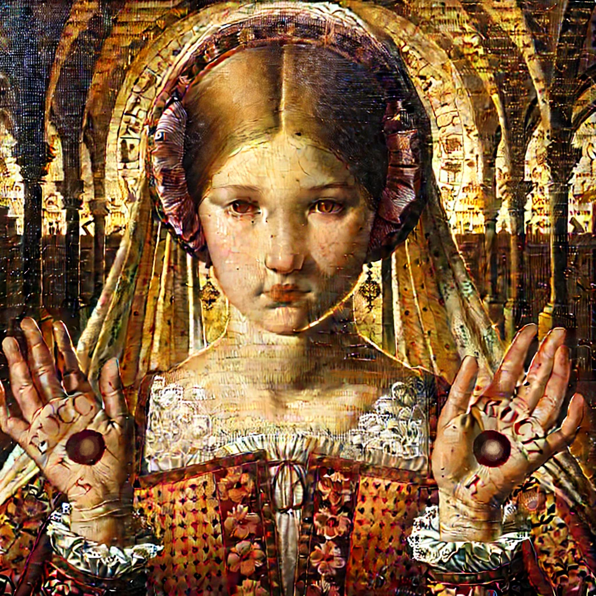

# 11. The Power of the Gemstone  
   

At last, Maria's family arrived in Obwalden. 
They checked the Gemstones Maria had sent ahead in advance. 

"Father, these Gemstones… they've grown even brighter!" 
Maria held one in both hands, just as she had done in the carriage, and activated its glow. 

Late at night, as soon as she stepped into the village, 
the light of the Gemstones spread throughout the settlement. 
All the weary villagers stirred as if infused with new energy. 

"Max, a scouting party came ahead of us and spread the word. 
They say a Jewish family has brought a miracle to aid the resistance." 

"You bet. I saw with my own eyes how they crushed the Emperor's men with a Gemstone boulder." 
"So I guess you're done with your candle business?" 

"Hah! Who needs candles when Switzerland is on the brink of independence?" 

On the mountain pass to Obwalden, villagers scurried about. 
They piled up firewood, prepared torches, and readied stones. 
The men sharpened halberds, axes, and spears on a whetstone. 
The moonlight reflected sharply off their polished edges. 

Maria stood before a large boulder, 
her father's dagger fastened with a Gemstone to the hilt. 

She held the Gemstone in both hands, her father gripping his dagger tightly. 

"Alright!" 
With a powerful strike, the boulder **split clean in half**. 

Next, they fastened a Gemstone to the catapult's release mechanism. 
When they launched a stone, it flew nearly ten times farther than expected, 
crashing into the reservoir and sending up a spray of sparks. 

"Everyone, did you see that? I'll distribute these Gemstones so you can attach them to your weapons." 
Maria dropped a heavy sack to the ground and handed out the glowing stones. 

The villagers erupted in cheers. 
For the first time in a long while, hope returned to their faces. 

   

# 12. Staking  
   

"Obwalden isn't the only one. Uri, Schwyz—every Swiss canton willing to fight— 
they all want access to the power of the Gemstones." 

Werner Stauffacher, the commander of the Swiss independence army, 
ran his hand over the Gemstone embedded in his sword hilt and looked at Maria's father. 

"But we can't just give them to anyone.  
Besides, only Maria has been able to awaken their full power so far." 

"You saw how the villagers rejoiced last night.  
In war, morale is more crucial than the enemy's numbers." 
Werner glanced around at the flickering watchfires. 
He patted Maria's father on the shoulder. 
"Talk to Maria. She might find a way." 

Back at their lodging, they found Max devouring roasted chicken, 
washing it down with beer. Maria sat beside him, nibbling bits of food, 
gravy smeared on her cheeks. 

Her uncle Andrea and Max, already in high spirits, 
were singing a loud Swiss folk song, arms linked. 

"When did you two become such good friends?" 
Maria's father sighed at the sight. 

Pulling Maria aside, he lowered his voice. 
"I'm uneasy about the Gemstones.  
The more I see them used, the more I feel we're handling something beyond us." 

"Me too, Father." 
Maria adjusted the leather strap that held a Gemstone pendant around her neck. 
"Mother always had nightmares about Gemstones… 
She said something dark was lurking within them. That scares me." 

Her father nodded solemnly. 

"But is there a way to properly harness their energy? 
Last night, you activated one and it lit up an entire bag of them." 

Maria tossed a single Gemstone into a sack.  
Immediately, every other stone inside began to glow. 

"When I release a Gemstone's power, it triggers all others it touches. 
This sack is shining because of the one I activated." 

Her father sighed deeply. 
"If we start lending them out, the power could be abused." 

"What if we ask for collateral?" 

"Like gold?" 
Maria answered without hesitation. 

"But we're wanderers. We can't store all that gold ourselves." 

"Right. That's where the Rothschild family comes in." 
Max, having overheard, poked his head up from under the table, his hair disheveled. 

Maria nodded. 
"They run the finest jewel trade and banking networks. 
If we let them manage the transactions, we can lend out the Gemstones." 

Her father frowned. "Would they even agree?" 

Max smirked. 
"Their patriarch recently fell ill, and the eldest son just took over. 
They might be more open to new ventures now. The old man was too stubborn." 

A few days later, Maria's father wrote a letter to the Rothschild family. 

At the same time, Schneider, the mercenary captain, was tasked with handpicking soldiers 
to escort Maria on her journey through the Swiss cantons. 

"If Maria travels and demonstrates the Gemstone's power firsthand, 
it will surely inspire more to rise up." 
Werner, the commander, gave his orders. 

Maria rummaged through her sack and picked out a large Gemstone for Schneider. 
"You're huge, so you need a big one too!" 

"Haha! Thanks, young lady." 

Within the week, Maria was set to embark on her journey. 
That night, restless, she visited her grandmother's house, 
where they whispered about old Gemstone legends until dawn. 

   

* [View Table of Contents](content_en.md)  
* [Read the Previous Part](/01_gemston/EN/EN_10.md)  
* [Read the Next Part](/01_gemston/EN/EN_13-14.md)  

