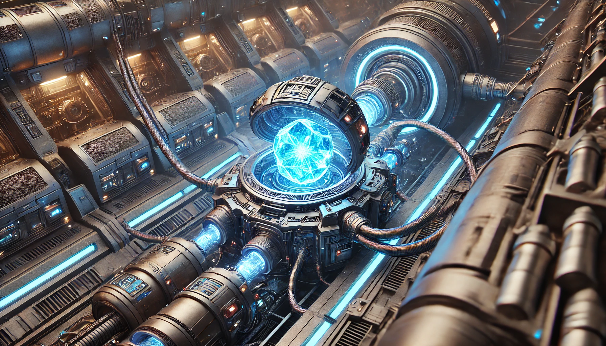

# GemSTON Universe

* 한국어로 된 소개는 여기에 있습니다 : [Korean ver](readme_ko.md).

<sapn style="color:grey">**_“We have discovered that vast energy vibrates in the form of very tiny strings and is trapped within the crystal structure of a specific mineral. That is all we have uncovered so far. The potential applications of this energy are limitless. Human society is facing new opportunities._** 

<sapn style="color:grey">**_However, we still do not know where this energy comes from."_** 

Dr. Karl Magnus, in an interview with CERN after his Nobel Prize was confirmed for proving string theory.

   

## 1. Introduction

This story is a fiction created by a fan who loves the GemSTON game. 

It depicts a new world centered around the imaginary gem, GemSTON. But is it really just an imaginary gem? 

We've often seen things thought to be fictional come to life. 

## 2. Book series
I have created a vast universe centered around GemSTON. I would love to hear your thoughts each time a new part is revealed.  

#### Books
* Book 1 : [GemSTON](/storymap/storymap.md)
* Book 2 : Grand Chase
* Book 3 : Awakening of the Gods
* Book 4 : Perseus Coalition
* Book 5 : Revelation
* Book 6 : Forest Path
 

## 3. Copyright & Resonsibility
This fiction is a personal work created by me as a fan of the GemSTON game and has no affiliation with Tokamak Network. 

All copyrights and responsibilities related to the novel are solely mine. 

## 4. GemSTON Game
GemSTON can be enjoyed as a game at Tokamak. It is a blockchain-based game. 