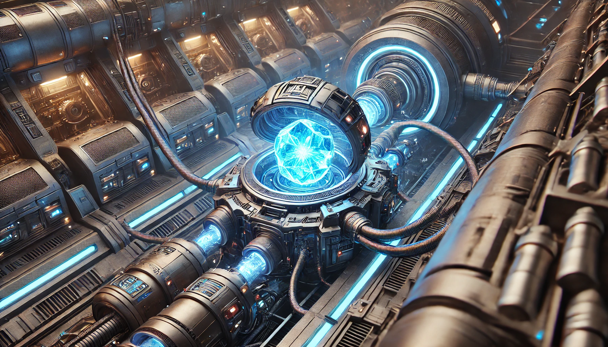
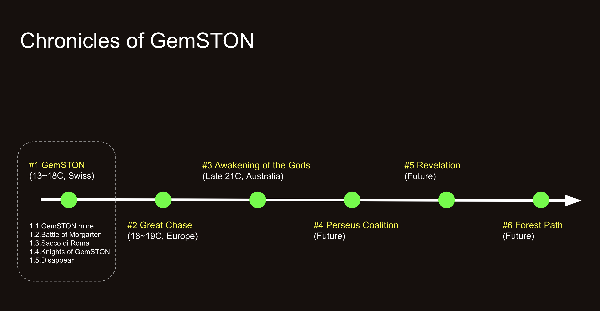

# GemSTON Universe

* You can find the English version : [English ver](readme.md).

<sapn style="color:grey">**_“막대한 에너지가 진동하는 아주 작은 끈의 형태로 모여있다는 것. 그리고, 그것이 특정한 광물질의 결정구조 속에서 안전하게 저장되어 있다는 것, 우리는 일단 거기까지만 밝혀냈습니다. 이 에너지의 활용용도는 무한합니다. 인류사회가 새로운 기회를 맞이하고 있습니다. 하지만 이 에너지가 어디에서 온 것인지는 아직 모릅니다._** 

<sapn style="color:grey">**_우리는 반드시 알아내야 합니다. 그리고 알게 될 것입니다._** 

칼 마그누스 박사 (끈이론의 증명으로 노벨상이 확정된 후 CERN과의 인터뷰 중에서)

   

## 1. Introduction

본 이야기는 GemSTON 게임을 사랑하는 팬으로써 만든 픽션입니다. 

가상의 보석 GemSTON을 중심으로 펼쳐지는 새로운 세상을 그려내고 있습니다. 
하지만 정말 가상의 보석일까요? 

허구라고 생각했던 것들이 진짜로 이뤄지는 것을 우린 많이 봐왔잖아요. 

## 2. Book series
저는 GemSTON을 중심으로 벌어지는 거대한 세계관을 만들었어요. 하나씩 공개될 때마다 여러분의 의견도 듣고 싶어요  

#### Books
* 1권 : GemSTON [읽기](/storymap/storymap.md)
* 2권 : Grand Chase
* 3권 : Awakening of the Gods
* 4권 : Perseus Coalition
* 5권 : Revelation
* 6권 : Forest Path

 

## 3. Copyright & Resonsibility
본 픽션은 GemSTON 게임을 좋아하는 팬으로서, 제가 창작한 개인적인 작품이므로, Tokamak Network와는 어떠한 관련도 없습니다.

소설에 대한 저작권과 그에 따르는 책임은 모두 저에게 귀속됩니다.

## 4. GemSTON Game
GemSTON은 토카막에서 게임으로 즐길 수 있습니다. 블록체인 기반의 게임입니다.