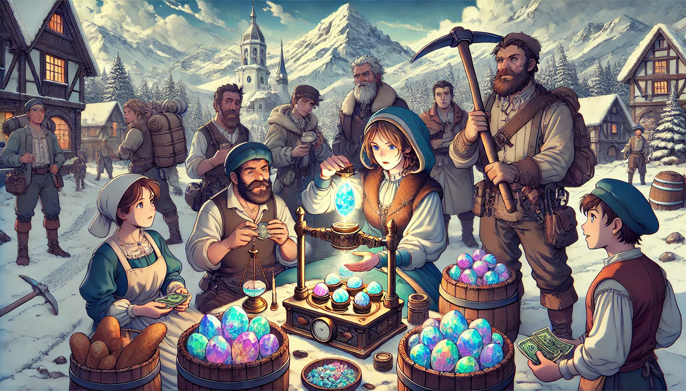
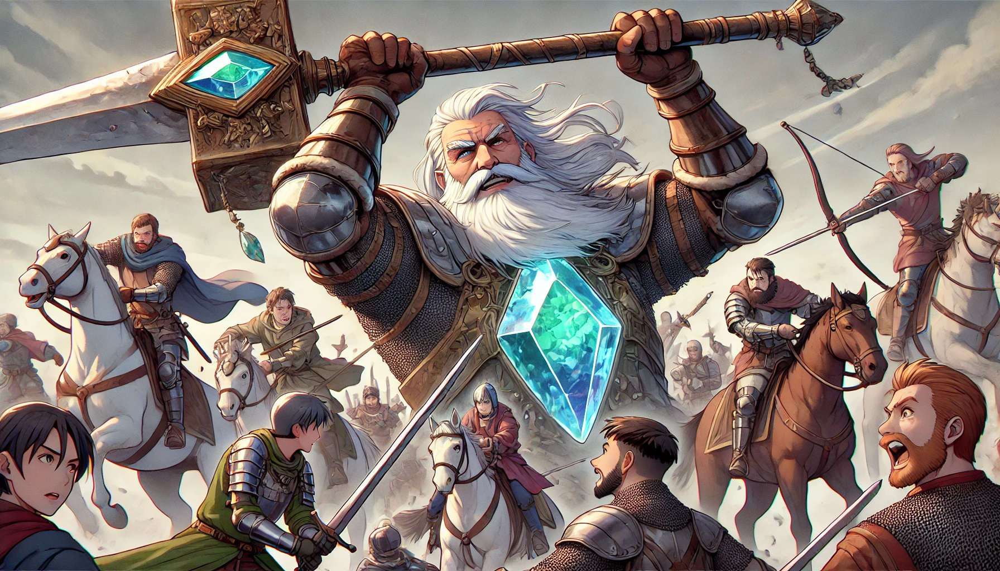
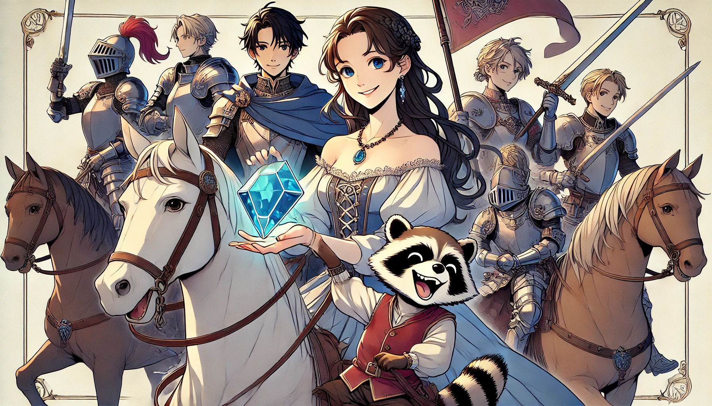
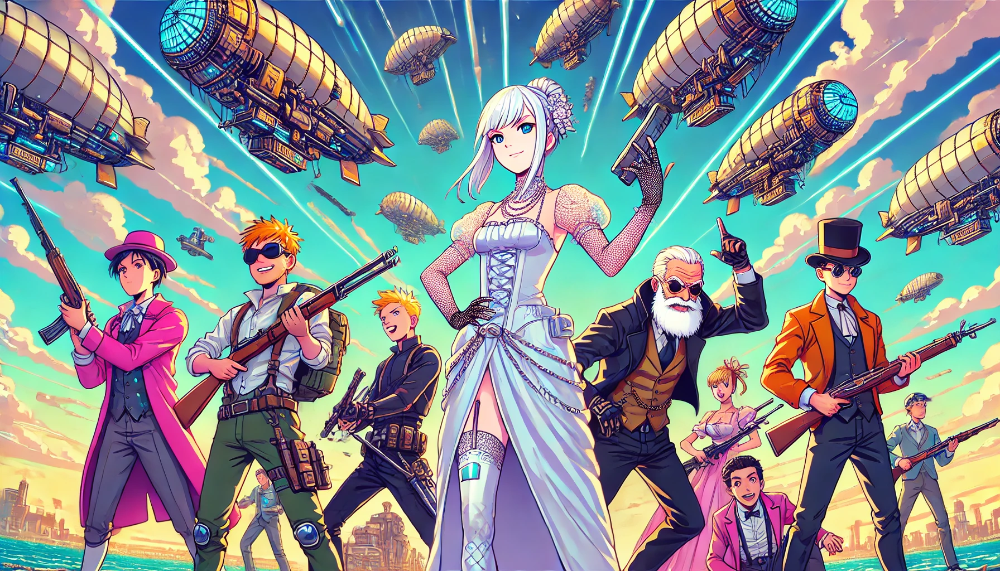

# Book 1 : GemSTON

## Chapter 1

### Chapter 1. Ever-burning Candles in Bern  
베른(Bern)의 꺼지지 않는 촛불  
* 1.1. [Maria](/01_gemston/01_(EN)maria.md) ([마리아](/01_gemston/01_(KR)maria.md))
* 1.2. Cezar (세자르)
* 1.3. Mining & Staking (마이닝 & 스테이킹)
* 1.4. The Avignon (교황청)

### Introduction
The term "jewelry" is so closely associated with Jews that it suggests they pioneered this new industry. In the 13th century medieval period, Maria's family, who had been wealthy from operating mines in Rome, were driven out due to Jewish persecution. Under Roman policies targeting Jews, all their valuables, including gold and treasures, were confiscated, leaving them only to take gems, which at the time were considered mere ornaments. They fled to neighboring Switzerland, but even there, they faced difficulties settling due to local hostilities. Amid these challenges, a power that had manifested only in the women of their family for generations began to emerge in Maria...

Jewelry(보석)이라는 말은 jew(유대인)에서 파생되었을 정도로 유대인은 보석이라는 새로운 산업을 만든 민족이다. 13세기 중세시대, 로마에서 광산을 운영하며 오랫동안 부자로 지낸 마리아의 가족은 유대교 박해로 인해 쫓겨나게 되었다. 로마의 유대교 정책상 금은보화를 비롯한 모든 것은 압수당했으며, 당시로서는 장식품 정도로만 여겨지던 보석들만 몸에 챙기고 옆나라 스위스로 오게 된 것이다. 하지만 이 곳에서도 텃새로 인해 정착의 어려움을 겪는다. 그 와중에 집안 대대로 여성들에게만 나타나는 능력이 마리아에 나타나게 되는데....

   

## Chapter 2

### Chapter 2. Battle of Morgarten  
모르가르텐 전투  
* 2.1. The Rising of Switzerland (일어서는 스위스)
* 2.2. Maria's Pilgrimage (마라이의 순례)
* 2.3. The Habsburg Dynasty (합스부르크 가문)
* 2.4. Miracle (기적)

### Introduction
comming soon

   

## Chapter 3

### Chapter 3. Sevne Knights of GemSTON  
잼스톤 기사단

* 3.1. The Knights of Templar (성전 기사단)
* 3.2. Forging (포징)
* 3.3. The GemSTON Knights (잼스톤 기사단)
* 3.4. Tori (토리)

### Introduction
comming soon

   

## Chapter 4

### Chapter 4. Disappear  
증발
* 4.1. EXPO 1851 LONDON (런던박람회)
* 4.2. The Resurrection of Caesar (세자르의 부활)
* 4.3. The Prophet (예언자)
* 4.4. To Eternity (영원속으로)

### Introduction
comming soon

